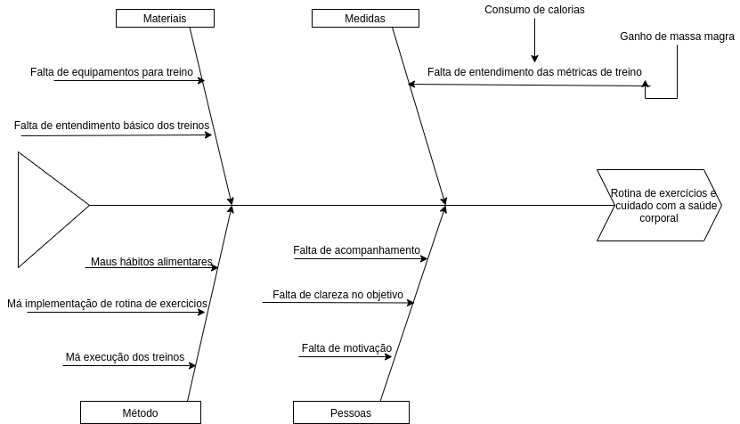

# Diagrama de Causa-Efeito

## o Diagrama de Causa-Efeito é uma ferramenta de qualidade que tem como finalidade ajudar a levantar as causas-raízes de um problema. Seguindo a metodologia, todo problema tem causas específicas, e essas causas devem ser testadas uma a uma a fim de comprovar qual delas realmente está causando o problema

## Versionamento do documento
| Autor | Data | Versão | Modificação |
|---|---|---|---|
| Ernando Braga | 08/09 | 1.0 | Criação do documento |