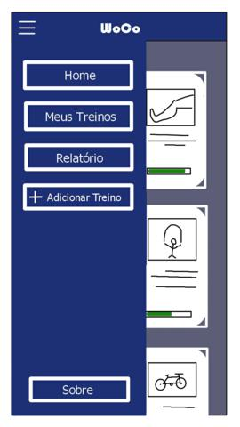
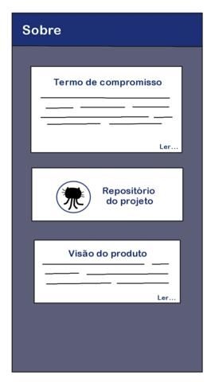
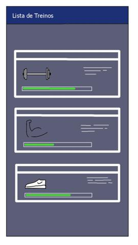
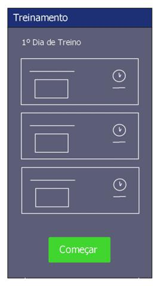
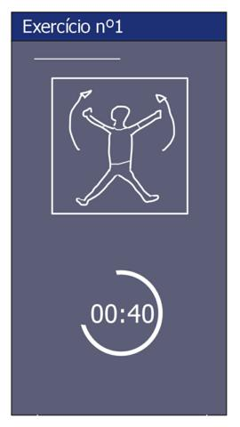

## Protótipo de Baixa Fidelidade
&nbsp;&nbsp;&nbsp;&nbsp;&nbsp;O protótipo de baixa fidelidade busca mostrar mediante sketches uma ideia superficial do aplicativo através de esboços de tela. Busca também demonstrar a idealização da interface e a disposição dos elementos e funcionalidades do projeto. É uma maneira rápida e fácil de traduzir conceitos de design de alto nível em artefatos tangíveis e testáveis. POssui apenas alguns dos atributos visuais do projeto e são apresentados para verificar e testar a funcionalidade, em vez da aparência do produto.

## Home
&nbsp;&nbsp;&nbsp;&nbsp;&nbsp;Primeiro contato do usuário com o aplicativo 

## Home Sidebar
&nbsp;&nbsp;&nbsp;&nbsp;&nbsp;Tela que dispõe as funcionalidades do aplicativo em uma barra lateral 

## Sobre Nós
&nbsp;&nbsp;&nbsp;&nbsp;&nbsp;Tela que fornece o termo de privacidade e informações internas do projeto 

## Listagem de Treinos
&nbsp;&nbsp;&nbsp;&nbsp;&nbsp;Tela que exibe informações personalizadas e/ou treinos pré-definidos 

## Adicionar Treino
&nbsp;&nbsp;&nbsp;&nbsp;&nbsp;Cadastrando exercícios para especificar e auxiliar suas atividade 

## Acompanhar Treino
&nbsp;&nbsp;&nbsp;&nbsp;&nbsp;Listagem dos Exercícios daquela sessão de exercícios 

## Execução do Treino
&nbsp;&nbsp;&nbsp;&nbsp;&nbsp;Feedback de tempo e exibição do exercício selecionado 

## Relatório
&nbsp;&nbsp;&nbsp;&nbsp;&nbsp;Conceder informações gerais sobre os dados de treino 

## Conclusão 
&nbsp;&nbsp;&nbsp;&nbsp;&nbsp;No decorrer do projeto esta visão e coloração poderá ser alterada devido a atualizações de proposta e complexidade da implementação. Este modelo proposto será discutido e atualizado entre os integrantes do grupo afim de democratizar a idealização do projeto.

***
## Versionamento de edições desta página
***

| Data | Autor | Descrição | Versão |
|------|-------|-----------|--------|
|08/09/2020| Bruno Duarte| Adicionando Protótipo de Papel| 0.1|

