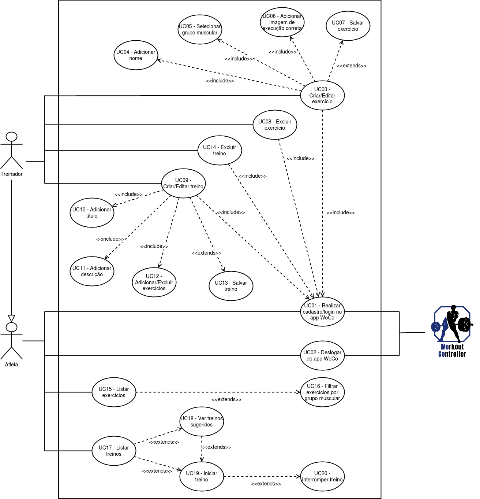
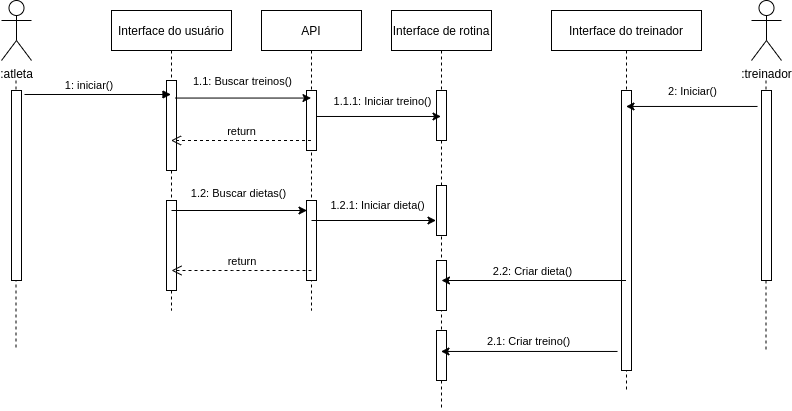

# Documento de Arquitetura de Software

#### Histórico de revisões
|    Data    | Versão |       Descrição       |    Autor(es)     |
| :--------: | :----: | :-------------------: | :--------------: |
| 29/10/2020 | 0.1 | Iniciando o documento e adicionando o Sumário | Weiller Fernandes |
| 29/10/2020 | 0.2 | Adicionando Representação Arquitetural | Weiller Fernandes |
| 03/11/2020 | 0.3 | Adicionando Visão de Casos de Uso | Weiller Fernandes |

## Sumário
  - [1. Introdução](#1-introducao)
    - [1.1 Objetivo](#11-objetivo)
    - [1.2 Escopo](#12-escopo)
    - [1.3 Definições, Acrônimos e Abreviações](#13-definicoes-acronimos-e-abreviacoes)
    - [1.4 Referências](#14-referencias)
    - [1.5 Visão Geral](#15-visao-geral)
  - [2. Representação Arquitetural](#2-representacao-arquitetural)
  - [3. Restrições e Metas Arquiteturais](#3-restricoes-e-metas-arquiteturais)
  - [4. Visão de Casos de Uso](#4-visao-de-casos-de-uso)
  - [5. Visão Lógica](#5-visao-logica)
  - [6. Visão de Processo](#6-visao-de-processo)
  - [7. Visão de Implementação](#7-visao-de-implementacao)
  - [8. Visão de Implantação](#8-visao-de-implantacao)
  - [9. Tamanho e Performance](#9-tamanho-e-performance)
  - [10. Qualidade](#10-qualidade)

## 1. Introdução

### 1.1 Objetivo

### 1.2 Escopo

### 1.3 Definições, Acrônimos e Abreviações

### 1.4 Referências

- [DAS Template](http://sce.uhcl.edu/helm/RationalUnifiedProcess/webtmpl/templates/a_and_d/rup_sad.htm)

### 1.5 Visão Geral

## 2. Representação Arquitetural

Este tópico descreve a arquitetura de software da aplicação e como ela é representada, através das tecnologias escolhidas para cada uma das três partes principais do app, são elas: O Back-end, Front-end e o Banco de Dados.

## 2.1. Front-end

Essa é parte visual da aplicação. É responsável pela comunicação com o Back-end e é através dela que o usuário é capaz de interagir com o aplicativo em si. Para o desenvolvimento do WoCo, a equipe optou por desenvolver uma aplicação mobile, pois esse tipo de aplicação se adequa melhor ao escopo do projeto.

### 2.1.1 Tecnologias

A definição do Flutter em seu site oficial é: "Flutter é um kit de ferramentas do Google para construir aplicações lindas, nativamente compiladas para mobile, web, desktop à partir de um único código-base."

O Flutter é um framework construído pela Google para facilitar o desenvolvimento mobile multiplataforma (Android/iOS) que tem o Dart como principal linguagem de desenvolvimento. Ele utiliza uma abordagem até então única para lidar com os componentes nativos de cada plataforma, em que cada um deles é implementado pelo próprio framework e apresentado ao usuário por um motor de renderização próprio.

O Flutter foi escolhido por ser uma tecnologia familiar para parte da equipe de desenvolvimento do projeto e por permitir um aprendizado relativamente rápido para aqueles que ainda não dominavam o framework. Outro aspecto levado em consideração nessa tomada de decisão é que o Flutter é mais rápido que o React Native, seu concorrente direto, a partir do momento em que ele não exige que o Javascript faça uma ponte para interagir com os componentes nativos do sistema.

## 2.2. Back-end

Essa é a camada de integração entre o Front-end e o Banco de Dados. Sua função é armazenar e disponibilizar os dados da aplicação para a visualização por parte do usuário.

### 2.2.1 Tecnologias

O Flask é um micro-framework web escrito em Python e baseado na biblioteca WSGI Werkzeug e na biblioteca de Jinja2. Ele tem a flexibilidade da linguagem de programação Python e provê um modelo simples para desenvolvimento web.
Ele é chamado de micro-framework porque mantém um núcleo simples mas extensível. Não há uma camada de abstração do banco de dados, validação de formulários, ou qualquer outro componente onde bibliotecas de terceiros existem para prover a funcionalidade, porém o Flask suporta extensões capazes de adicionar tais funcionalidades na aplicação final. Há uma vasta coleção de bibliotecas para resolver essas questões em Python, isso simplifica o framework e torna sua curva de aprendizado mais suave.

Esses fatores inclusive, foram determinantes para a escolha do Flask, sua simplicidade e curva de aprendizado suave tornam o seu uso no projeto WoCo algo bastante tranquilo e satisfatório.

## 2.3. Banco de Dados

Essa é a camada de persistência de informações. É ela que fornece para o back-end as informações e dados que serão exibidos na tela do usuário através do front-end.

### 2.3.1 Tecnologias

SQLite é uma biblioteca de código aberto (open source) desenvolvido na linguagem C que permite a disponibilização de um pequeno banco de dados na própria aplicação, sem a necessidade de acesso a um SGDB separado. A estrutura de banco junto com a aplicação é denominada de “banco de dados embutido” e é indicada para aplicações de pequeno porte, que utilizam poucos dados.

O SQLite foi escolhido pelo fato do WoCo ser uma aplicação simples, um projeto de pequena escala. Dessa forma, o SQLite satisfaz todas as necessidades do projeto.

## 3. Restrições e Metas Arquiteturais

## 4. Visão de Casos de Uso

### 4.1 Atores

|    Atores    |       Descrição       |
| :--------:   |:-------------------:  |
| Treinador   |  Usuário responsável por criar e adicionar os treinos e exercícios que serão usados pelos Usuários Atletas da plataforma.   |
| Atleta      | Usuário que deseja usar a plataforma para monitorar e controlar seus treinos do dia a dia.|
| WoCo        | Responsável por autenticar os usuários e apresentar treinos e exercícios cadastrados na plataforma. |

### 4.2 Diagrama de Casos de uso

**Versão 1.0**

### 4.3 Descrição dos casos de Uso

| Caso de Uso | Descrição |
| :-------:   | :-------: |
| UC01 - Realizar cadastro/login no app   | O usuário se cadastra na aplicação ou realiza o login se já possuir cadastro. |
| UC02 - Deslogar do app| O usuário logado "desloga" da aplicação.|
| UC03 - Criar/editar exercício| O treinador cria um exercício novo ou edita um existente. |
| UC04 - Adicionar nome | O treinador adiciona um nome ao exercício que está sendo criado/editado.|
| UC05 - Selecionar grupo muscular| O treinador seleciona um grupo muscular para o exercício que está sendo criado/editado.|
| UC06 - Adicionar imagem de execução correta| O treinador adiciona uma imagem ao exercício que está sendo criado/editado, demonstrando como é a forma correta de realizar esse exercício.|
| UC07 - Salvar exercício| O treinador salva o exercício que criou/editou.|
| UC08 - Excluir exercício| O treinador exclui um exercício que havia criado.|
| UC09 - Criar/editar treino | O treinador cria um treino novo ou edita um existente.|
| UC10 - Adicionar título|O treinador adiciona um título ao treino que está sendo criado/editado.|
| UC11 - Adicionar descrição| O treinador adiciona uma descrição ao treino que está sendo criado/editado.|
| UC12 - Adicionar/excluir exercícios| O treinador adiciona ou exclui exercícios do treino que está sendo criado/editado.|
| UC13 - Salvar treino| O treinador salva o treino que criou/editou.|
| UC14 - Excluir treino | O treinador exclui um treino que havia criado.|
| UC15 - Listar exercícios| O atleta lista todos os exercícios cadastrados na aplicação.|
| UC16 - Filtrar exercícios por grupo muscular| O atleta filtra os exercícios da aplicação para visualizar apenas os que pertencem a um ou mais grupos musculares.|
| UC17 - Listar treinos| O atleta lista todos os treinos cadastrados na aplicação.|
| UC18 - Ver treinos sugeridos| O atleta visualiza os treinos sugeridos para o seu perfil (iniciante, intermediário ou avançado).|
| UC19 - Iniciar treino | O atleta escolhe um treino listado para poder iniciar.|
| UC20 - Interromper treino| O atleta interrompe um treino que havia iniciado.|

## 5. Visão Lógica

## 6. Visão de Processo
A <i>Visão de Processos</i> mostra como será feito o modelo de projeto, tendo como base uma visualização em sequência.

### Diagrama de Sequência

## 7. Visão de Implementação

## 8. Visão de Implantação

## 9. Tamanho e Performance

## 10. Qualidade
