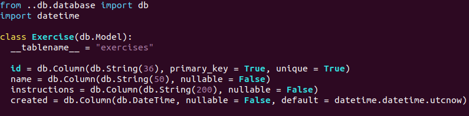
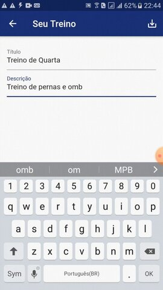

## Reutilização de Software
A Reutilização de Software é uma das áreas da Engenharia de Software que propõe um conjunto sistemático de processos, de técnicas e de ferramentas para obter agilidade e facilidade no desenvolvimento de um software.

## Flask
Flask é um micro-framework para Python, segundo a documentação fornecida pelos desenvolvedores cujo conceito de micro-framework está relacionado a permitir que o Flask possua um núcleo simples e extensivo possibilitando maior liberdade ao desenvolvedor atender suas necessidades.

### Hot Spots no Flask 
***Representam as partes do framework de aplicação que são específicas de sistemas individuais e são projetados para serem genéricos, cabendo adaptá-los às necessidades da
aplicação.***
No contexto do Backend WoCo o flask nos da a liberdade de utilizar um banco de dados de nossa preferência, através do ORM SQLALCHEMY. Neste projeto utilizamos o Sqlite.

* SQLALCHEMY

O Flask também permite uma maneira de organizar uma aplicação em Flask em pedaçoes pequenos e reutilizáveis, definindo uma coleção de Views, Templates e arquivos estáticos. E depois registrado dentro de uma aplicação Flask.

### Frozen Spots no WoCo
***Definem a arquitetura geral de um sistema de software, ou seja, seus componentes básicos bem como os relacionamentos entre eles.Permanecem fixos em todas as instanciações do framework de aplicação.***No contexto do WoCo podemos destacar o retorno de status de requisições http no login.

* Status 200, 404

### Adapter no WoCo
Converte a interface de uma classe em outra interface para atender alguma funcionalidade necessária. O adapter permite que as classes trabalhem juntas em prol de um objetivo na aplicação.

No WoCo teremos uma model central referente as infomações dos exercícios cadastrados.

A parte do Adapter se encaixa na realização do parse dessas informações através de uma outra classe denominada ExerciseSerializer.

### Singleton no WoCo
Singleton para prover um recurso único de conexão com a base de dados, permitindo uma maior segurança para toda aplicação.

## Flutter
Criado pelo Google, o Flutter é um framework, ou seja, um facilitador no desenvolvimento, que possibilita criar aplicativos mobile para Android e iOS com algumas funcionalidades vantajosas para o dia a dia de um desenvolvedor.

### Hot Spot no Flutter
Os pontos flexíveis deste framework possibilitam finitas combinações e alterações a cargo do desenvolvedor. O WoCo visa aproveitar desses recursos na construção de Widgets, containers, appbars, buttons e outra gama de possibilidades oferecidas nesse framework. Podemos exemplificar 

* Estruturação de pastas

* Personalização de Widgets

### Frozen Spot no Flutter
A parte fixa do flutter seria essa integração de Portabilidade, os próprios arquivos que permitem uma aplicação ser compatível com sistemas operacionais distintos junto a sua própria estruturação de pastas e arquivos.

* Estruturação/Arquivos Fixos

### BLoC no WoCO
O ***bloc*** seria um componente central que ficaria responsável de receber ***eventos*** fornecidos pelo usuário ou pelo sistema através da interface, este componente também seria responsável por retornar um ***estado*** a aplicação. E assim cada widget teria seu funcionamento modularizado no aplicativo facilitando a manutenção e compreensão das funcionalidades. 

* Estruturação do Design Pattern BLoC

* Trechos Centrais utilizando BLoC

## Reutilização do Protótipo
A reutilização de software não envolve somente fatores de desenvolvimento, como a utilização de códigos, ferramentas e frameworks mas também no nível de requisitos e outros artefatos. 

&nbsp;&nbsp;&nbsp;&nbsp;

&nbsp;&nbsp;&nbsp;&nbsp;

&nbsp;&nbsp;&nbsp;&nbsp;

#### Histórico de revisões
|    Data    | Versão |       Descrição       |    Autor(es)     |
| :--------: | :----: | :-------------------: | :--------------: |
| 19/11/2020 | 0.1 | Iniciando o documento | Bruno Duarte |
| 20/11/2020 | 0.2 | Adicionando Reutilização WoCo Backend  | Bruno Duarte, Ernando Braga, Davi Alves |
| 20/11/2020|0.3|Reutilização Front End|Bruno e Eugênio Sales|
| 20/11/2020|0.3|Reutilização Front End Design Pattern|Bruno, Weiller e Eugenio|

