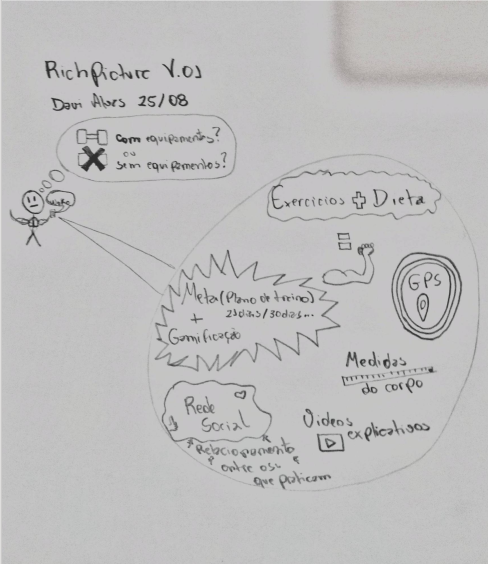
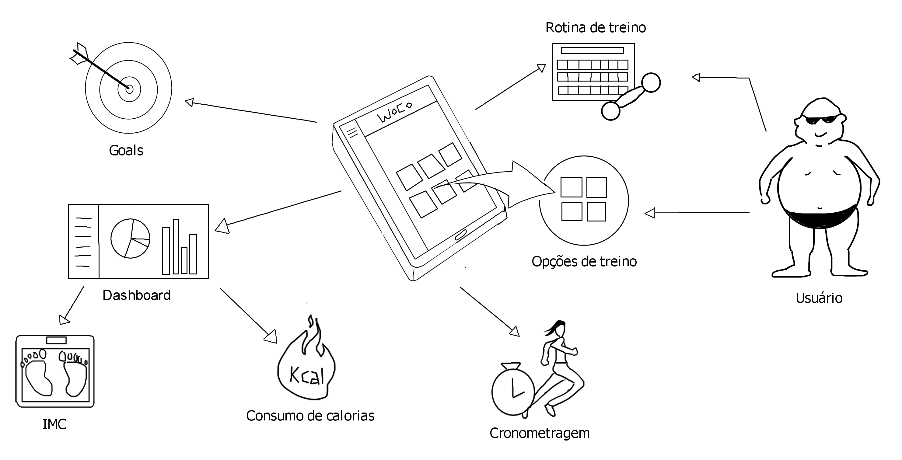
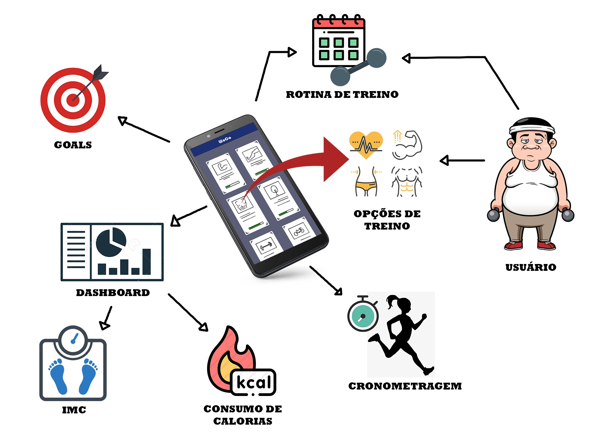
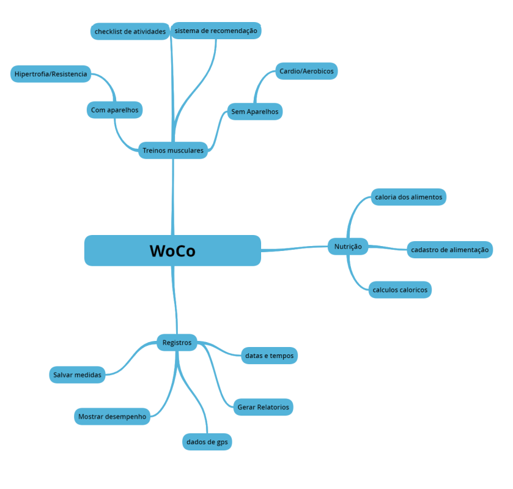
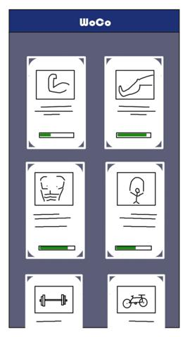

## Design Sprint

É um processo de cinco etapas para responder a questões críticas de negócios por meio de design, prototipagem e ideias e testes. 
O objetivo é poder reduzir o ciclo de debates intermináveis ​​e compactar meses de tempo em uma única semana. Em vez de esperar para lançar um produto mínimo para entender se uma ideia é boa, você obterá dados claros de um protótipo realista. O sprint dá a você um superpoder: você pode avançar no futuro para ver seu produto acabado e as reações do cliente, antes de fazer qualquer compromisso caro.

## Etapa I - Descompactação
As discussões realizadas nesta etapa criam uma estruturação do projeto e compartilhamento do que se tem em mente. Os artefatos que corroboram para esta etapa são:

* [Introspecção](../1.4\ Iniciativas\ Extras/Introspeccao.md)

* [Levantamento de Tecnologias](../1.4\ Iniciativas\ Extras/levantamento-de-tecnologias.md)

* [Mapa Mental](./mapa_mental/mapa-mental.md)

## Etapa II - Esboço
As ideias e reuniões da etapa anterior são representadas como desenhos e a visão de cada integrante está contida neles. Nessa etapa temos dois **Rich Pictures** que foram elaborados para abordar o projeto

> Versão Inicial

> Nova Versão

## Etapa III - Aperfeiçoamento
Após as etapas anteriores os artefatos que foram gerados, os rich pictures e documentos foram analisados e chegamos a uma versão mais sólida do projeto. Os artefatos que nos ajudaram a criar um protótipo foram uma nova versão do rich picture e para suprir o storyboard foram realizadas as entrevistas. Segue abaixo estes artefatos:

### Rich Picture  versão 0.3

### Mapa Mental versão 0.2

* [Entrevistas](./Entrevista.md)

## Etapa IV - Protótipo
Temos a elaboração de um protótipo que visa ser uma visão bem próxima do projeto. Segue algumas imagens do protótipo

### Home

Ressalvo que o Protótipo completo possui um documento específico que relata todas as telas e o conteúdo ali presente bem [aqui](./prototipo/prototipo_baixafidelidade.md).

## Observações
Todos os artefatos aqui citados possuem um documento específico relatando o versionamento e as particularidade de cada artefato e/ou versão.

* [Rich Picture](./rich-picture/richpicture.md)

* [Mapa Mental](./mapa_menta/mapa-mental.md)

* [Protótipo](./prototipo/prototipo_baixafidelidade.md)

* [Entrevistas](./Entrevista.md)

## Referências

> THE DESIGN Sprint. [S. l.], 2019. Disponível em: https://www.gv.com/sprint/. Acesso em: 9 set. 2020.

> DESIGN sprints: what they are and how to successfully run one. [S. l.], 2020. Disponível em: https://miro.com/blog/design-sprint-guide/. Acesso em: 11 set. 2020.

### Versionamento
|Data|Versão|Alteração|Autor|
|----|------|---------|-----|
|11/09/2020|0.1|Adicionando Design Sprint|Bruno Duarte|
