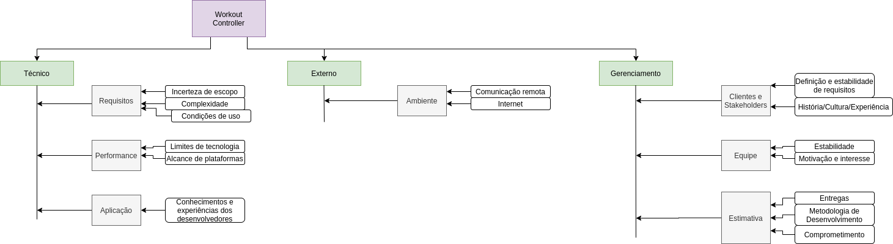

# Gerenciamento de Riscos do Projeto

## EAR - Estrutura Analítica de Riscos
EAR é uma alternativa de apresentar os riscos de um projeto de forma estruturada. Ela pode auxiliar o gerente de projetos na identificação de riscos, e nas demais etapas do processo de gerenciamento de riscos.

Usaremos a abordagem voltada para os objetivos do projeto por categoria, e suas hierarquias.

## Versionamento do documento
| Autor | Data | Versão | Modificação |
|---|---|---|---|
| Ernando Braga | 08/09 | 1.0 | Criação do documento |