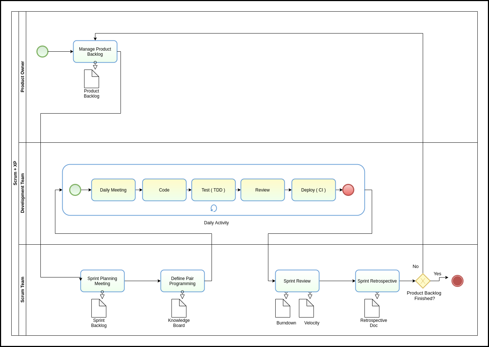

# Modelagem BPMN das metodologias Scrum e XP

<!--  -->

## Referências

[1] Videoaulas e materiais complementares presentes no moodle da disciplina Arquitetura e Desenho de Software. Disponível em [moodle de desenho](https://aprender3.unb.br/course/view.php?id=158)  
[2] agile alliance. Extreme Programming. Disponível em [agilealliance](https://www.agilealliance.org/glossary/xp/#q=~(infinite~false~filters~(postType~(~'post~'aa_book~'aa_event_session~'aa_experience_report~'aa_glossary~'aa_research_paper~'aa_video)~tags~(~'xp))~searchTerm~'~sort~false~sortDirection~'asc~page~1))

#### Versionamento
|   Data   |  Versão  |        Descrição       |          Autor(es)          |
|:--------:|:--------:|:----------------------:|:---------------------------:|
| 11/09/2020|   0.1    | Adição de detalhamento de metodologia |  Eugênio Sales  |
