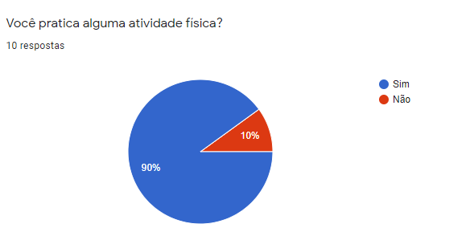
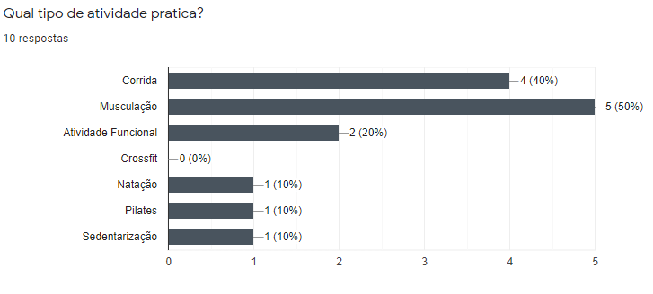
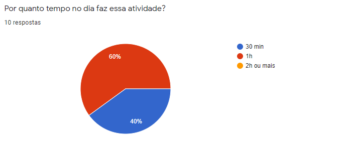
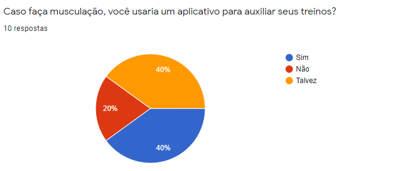
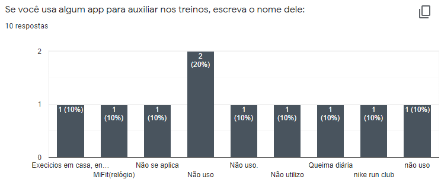
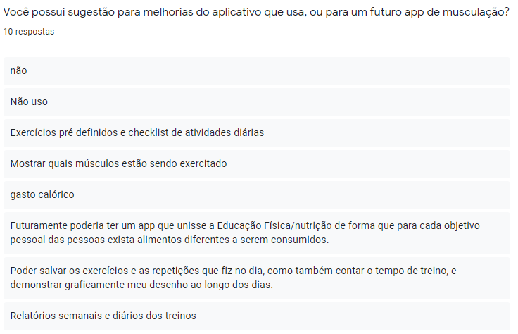

# Questionario para levantamento de requisitos

#### Histórico de revisões
|   Data   |  Versão  |        Descrição       |          Autor(es)          |
|:--------:|:--------:|:----------------------:|:---------------------------:|
|07/09/2020|   0.1    | Iniciando o documento       |  Davi Alves  |

## 1. Introdução

O uso de questionários de pesquisa online para coletar dados apresenta diversas vantagens, especialmente se compararmos a outros formatos.Uma outra vantagem dos formulários online é a redução nos custos, principalmente se compararmos às entrevistas presenciais. O questionario criado para a verificação das funcionalidades do WoCo e para o levantamento dos requisitos basicos foi aplicado por 2 dias e teve o total de 10 respostas. A equipe achou um numero razoavel para iniciar as analises.

## 2. Perguntas e Respostas

## 3. Conclusão

Durante a analise dos resultados notamos que a musculação é bastante praticada e boa parte das pessoas gostariam de um app para acompanhar seus treinos. Dentre os requisitos levantados temos alguns que foram representados no mapa mental e nos rich pictures.

