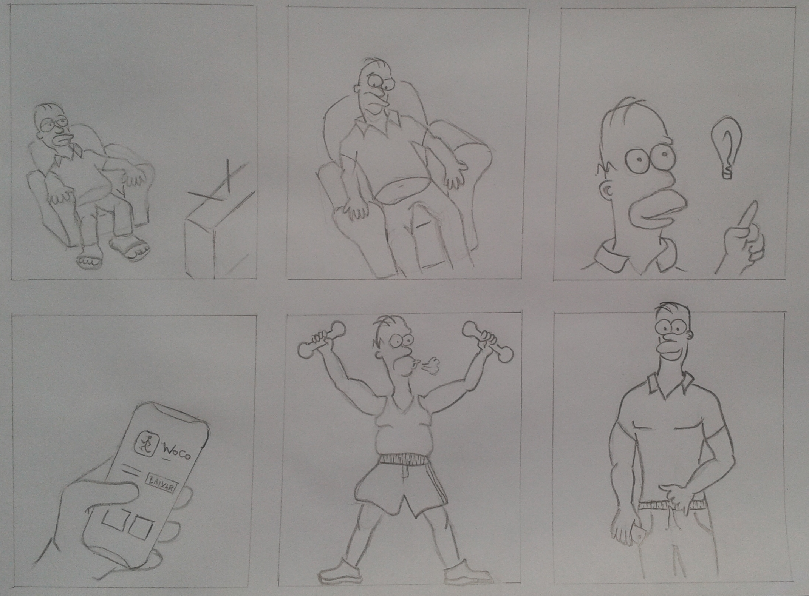
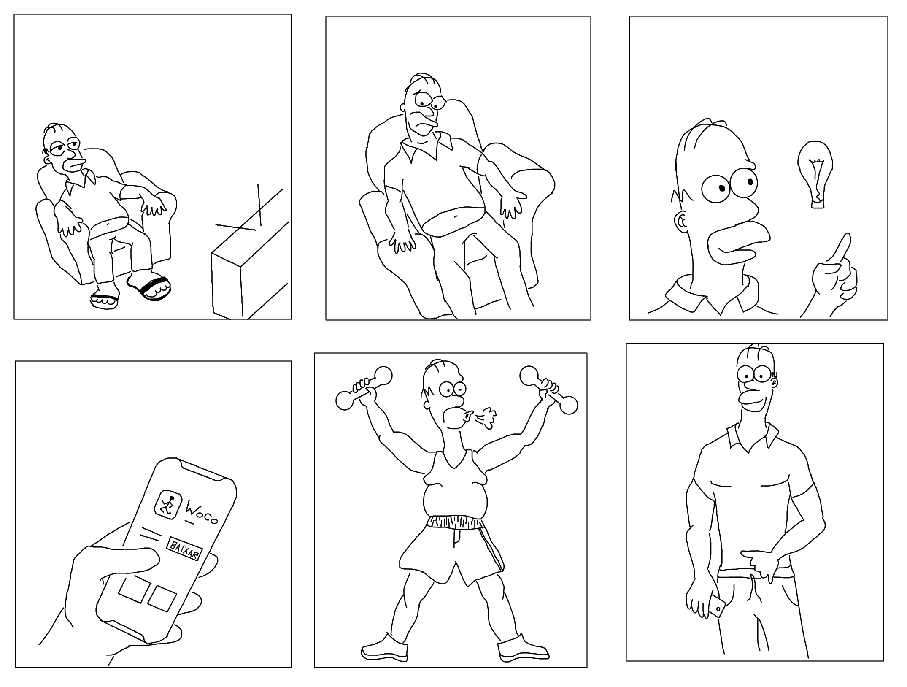
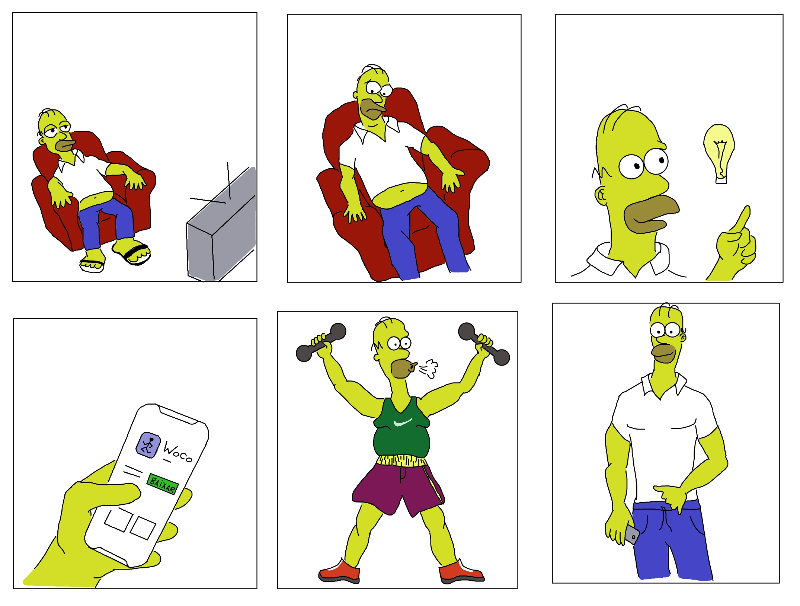

## Storyboard
Storyboard é uma ferramenta que pode ajudar os desenvolvedores a entender rapidamente o trabalho que precisa ser concluído. O Storyboard fornece transparência ao proprietário do produto e também ajuda a equipe na visualização de sequência e interconectividade das histórias de usuários.

## Resumo
A história que o storyboard tenta passar é de que um usuário sedentário que visa melhorar suas condições de saúde e consequentemente de estética procura uma forma de exercitar-se, ele tem uma ideia de algo que pode ajudá-lo nesta missão: WoCo. Depois de um tempo utilizando a aplicação os resultados começam a aparecer, gerando assim a satisfação do usuário. 
### Versões

> Storyboard versão inicial que foi idealizada pelo grupo durante as reuniões

* Autor: Bruno Duarte 

> Storyboard versão 0.1 que foi uma daptação da versão anterior digitalizada

* Autor: Bruno Duarte

> Storyboard versão 0.2 que foi uma coloração da etapa anterior
* Autor: Bruno Duarte

## Referências

> Lindgaard, G., Dillon, R., Trbovich, P., White, R., Fernandes, G., Lundahl, S., Pinnamaneni, A.: User needs analysis and requirements engineering: Theory and practice. Interact. Comput. 18(1), 47–70 (2006)
CrossRefGoogle Scholar

> Haesen, M., Coninx, K., Van den Bergh, J., Luyten, K.: MuiCSer: A Process Framework for Multi-Disciplinary User-Centered Software Engineering processes. In: Proc. of Human-Centred Software Engineering, September 2008, pp. 150–165 (2008)
Google Scholar

> Brown, J., Lindgaard, G., Biddle, R.: Stories, Sketches, and Lists: Developers and Interaction Designers Interacting Through Artefacts. In: Proc. of Agile 2008, pp. 39–50 (2008)
Google Scholar

***
## Versionamento de edições desta página
| Data | Autor | Descrição | Versão |
|------|-------|-----------|--------|
| 24/10/2020 | Bruno Duarte | Criação e edição inicial da página. | 0.1 |
|24/11/2019|Bruno Duarte|Adicionando versões do Storyboard|0.2|