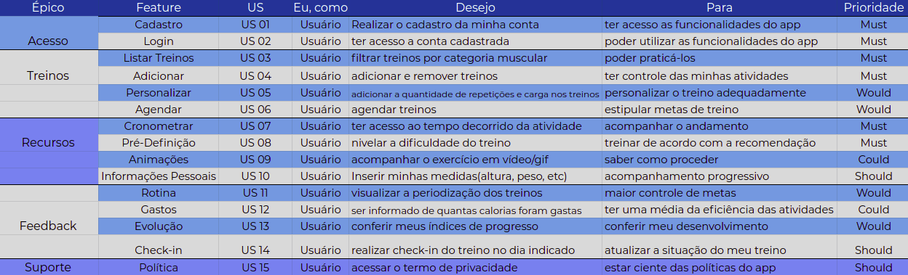

# Backlog do Produto

### Introdução

A técnica do Backlog do Produto é uma lista na qual é reunida os requisitos elicitados e priorizados para construção do Roadmap do Produto. Consiste então, uma lista de funcionalidades desejadas para o produto.

### Metodologia

Para o levantamento dos épicos e features, foram usados documentos anteriores, tais como introspecção, documento de visão e brainstorm.

### Histórico de revisões
|Data|Versão|Alteração|Autor|
|----|------|---------|-----|
| 11/09/2020 | 0.1 | Criação do documento Backlog do Produto. | Bruno Duarte | 
| 11/09/2020 | 0.2 | Adicionando tabela do backlog | Bruno Duarte|
| 15/10/2020 | 1.0 | Refatoração do backlog voltado para as roles dos usuários | Ernando Braga |
