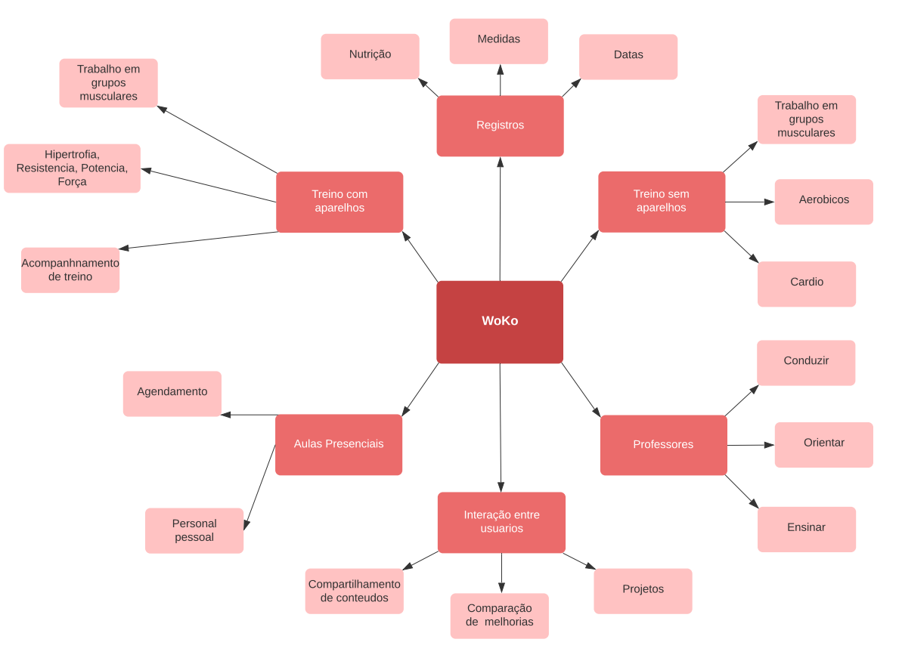
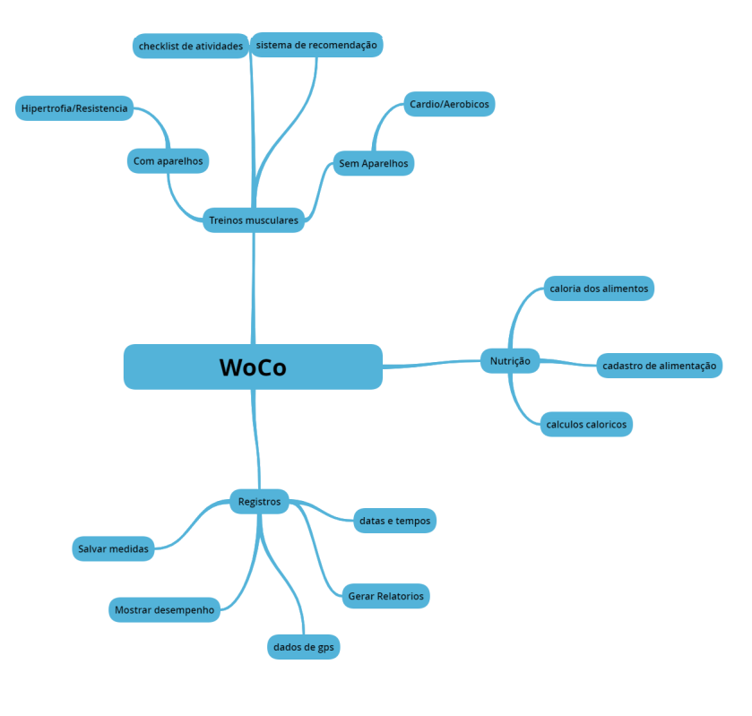

# Mapa Mental

#### Histórico de revisões
|   Data   |  Versão  |        Descrição       |          Autor(es)          |
|:--------:|:--------:|:----------------------:|:---------------------------:|
|03/09/2020|   0.1    | Iniciando o documento       |  Davi Alves  |
|04/09/2020|   0.2    | Adicionando segunda versão | Davi Alves |

## 1. Introdução

Mapa mental é uma técnica de estudo criada no final da década de 1960 por Tony Buzan, um consultor inglês. Ela consiste em criar resumos cheios de símbolos, cores, setas e frases de efeito com o objetivo de organizar o conteúdo e facilitar associações entre as informações destacadas. Esse material é muito indicado para pessoas que têm facilidade de aprender de forma visual.

O mapa mental também pode ser usado em outras áreas especificas como no nosso caso para elicitação de requisitos de determinada aplicação. No caso do WoCo foi bastante importante para termos ideia de quais são as principais características de um app do gênero.

## 2. Versão 01 - Mapa mental

 

**Versão: 0.1**  
*Autor: Davi Alves.*

> Versão Inicial do Mapa Mental feita a partir do que foi discutido inicialmente pelo grupo.

 

A primeira versão foi pensada a partir de aplicativos já existentes como:
Freeletics Training Coach - Bodyweight & Mindset
8Fit - Exercícios & Planejador Alimentar
Nike Training Club
Treino em Casa para Homens
Fitness e Musculação
7 Minute Workout
Fitness Point
Workout Trainer
iMuscle 2
Google Fit
FitBit

A quantidade de funcionalidades de cada um dos aplicativos foram analisadas para que pudessemos pensar em algo para a nossa aplicação.

## 3. Versão 02 - Mapa mental

 

**Versão: 0.1**  
*Autor: Davi Alves.*

> Versão Inicial do Mapa Mental feita a partir do que foi discutido inicialmente pelo grupo.

 

A segunda versão mais limpa da aplicação foi baseada no questionario elaborado e analisado pela equipe, nela ficaram apenas as mais importantes para os usuarios finais. Futuramente pode ser implementado algumas das ideias contidas na primeira versão.

## Referências

[1] Videoaulas e materiais complementares presentes no moodle da disciplina Arquitetura e Desenho de Software. Disponível em: https://aprender3.unb.br/course/view.php?id=158
