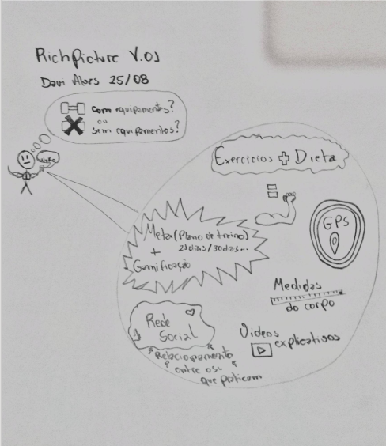

# RichPicture
O RichPicture é uma técnica que serve para a obtenção do entendimento e idealização de determinado sistema. Ele é desenvolvido, inicialmente, à mão-livre, ou utilizando esboços.

***
## Versões Desenvolvidas
***

### [RichPicture01] - Versão Inicial

 

**Versão: 0.1**  
*Autor: Davi Alves.*

> Versão Inicial do Rich Picture feita a mão a partir do que foi discutido inicialmente pelo grupo.

 

**Versão: 0.2**  
*Autor: Bruno Duarte.*

>Versão feita com base em sketcher visando aprimorar o que foi proposto na versão anterior

***
## Referências
***
* **[Ebrary]** Young. Ralph. Requirements Engineering Handbook. Norwood, US: Artech House Books, 2023.
* **[Open Acess]** Leite, Julio Cesar Sampaio do Prado. Livro Vivo - Engenharia de Requisitos.
* **[Ebrary]** Chemuturi, Murali. Matering Software Quality Assurance : Best Pratices, Tools and Technique for Software Developers. Ft. Lauderale, US: J. Ross Publishing Inc., 2010.
***

## Versionamento
***

| Data | Autor | Descrição | Versão |
|------|-------|-----------|--------|
| 03/09/2020 | Davi Alves | Adicionando primeira versão | 0.1 |
| 06/09/2020 | Bruno Duarte | Adicionando v2 Rich Picture | 0.2|
