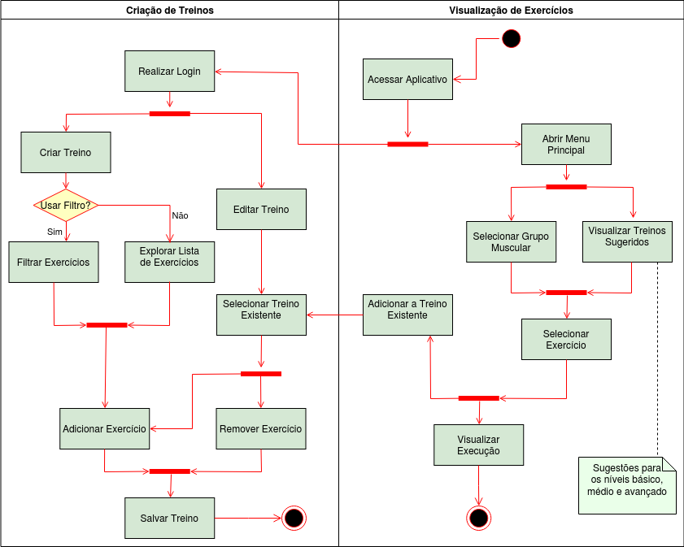

# Diagrama de Atividades

#### Histórico de revisões
|    Data    | Versão |       Descrição       |    Autor(es)     |
| :--------: | :----: | :-------------------: | :--------------: |
| 23/09/2020 |  1.0   | Iniciando o documento | Weiller Fernandes|
| 23/09/2020 | 1.1 | Adicionando Diagrama de Atividades | Weiller Fernandes |

## 1. Introdução

O diagrama de atividades é um diagrama de comportamento UML que mostra o fluxo de controle ou o fluxo de objetos com ênfase na parte comportamental, como tomadas de decisões, procedimentos e fluxos de trabalho.

## 2. Diagrama de Atividades

## Referências

[1] Activity Diagrams. Disponível em: <https://www.uml-diagrams.org/activity-diagrams.html>. Acesso em: 22 set. 2020.

[2] Videoaulas e materiais complementares presentes no moodle da disciplina Arquitetura e Desenho de Software. Disponível em: <https://aprender3.unb.br/course/view.php?id=158>. Acesso em: 22 set. 2020.
