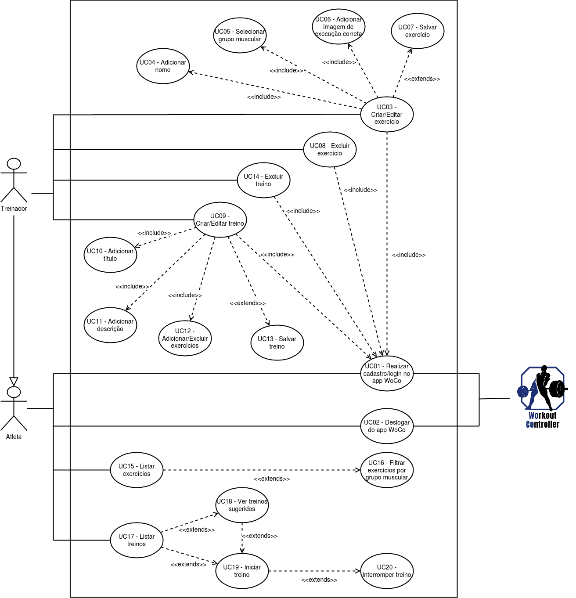

# Diagrama de Casos de Uso

## 1. Introdução

Os diagramas de caso de uso são geralmente referidos como diagramas de comportamento usados ​​para descrever um conjunto de ações (casos de uso) que algum sistema ou sistemas devem ou podem executar em colaboração com um ou mais usuários externos do sistema (atores). Cada caso de uso deve fornecer algum resultado observável e valioso para os atores ou outras partes interessadas do sistema. Esse diagrama é uma excelente ferramenta para o levantamento dos requisitos funcionais do sistema.

## 2. Diagrama de Casos de Uso

## Referências

[1] UML Use Case Diagrams. Disponível em: <https://www.uml-diagrams.org/use-case-diagrams.html>. Acesso em: 03 nov. 2020.

#### Histórico de revisões
|    Data    | Versão |       Descrição       |    Autor(es)     |
| :--------: | :----: | :-------------------: | :--------------: |
| 03/11/2020 |  1.0   | Iniciando o documento | Weiller Fernandes|
| 03/11/2020 | 1.1 | Adicionando Diagrama de Casos de Uso| Weiller Fernandes |
