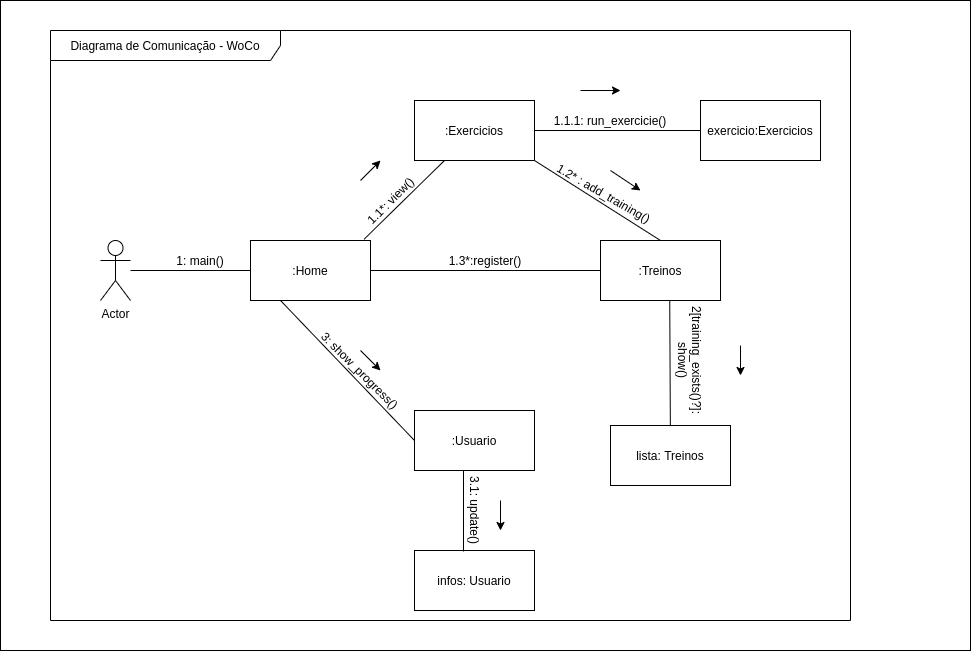
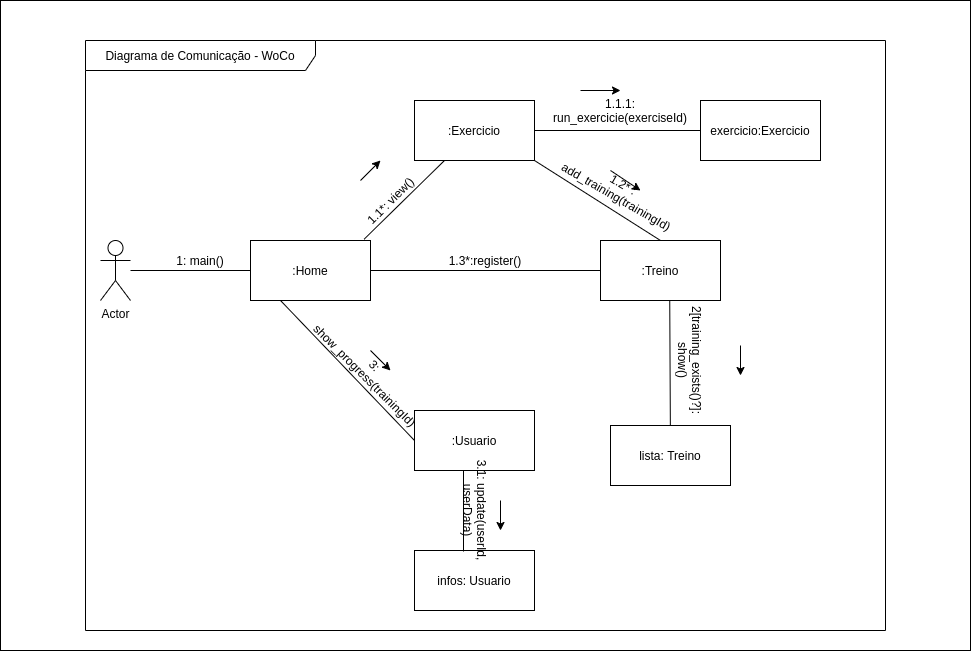

## Diagrama de Comunicação

Os diagramas de comunicação UML , como os diagramas de sequência - uma espécie de diagrama de interação, mostram como os objetos interagem. Além das associações entre objetos, o diagrama de comunicação mostra as mensagens que os objetos enviam entre si. Dentre os objetivos podemos listar:

* Transmitir mensagens de modelo entre objetos ou funções que fornecem as funcionalidades de casos de uso e operações
* Demonstrar interações que mostram as mensagens passadas entre objetos e funções dentro do cenário de colaboração
* Modelar cenários alternativos dentro de casos de uso ou operações que envolvem a colaboração de diferentes objetos e interações

### Diagrama de Comunicação

**Versão: 0.1**  
*Autor: Bruno Duarte.*
>Primeira versão do Diagrama de Comunicação que visa demonstrar as relações entre as classes e objetos através dos métodos e funções

### Referências

[1] Monitoria de Engenharia de Software - Diagrama de Comunicação UML. Disponível em: <https://monitoriadeengenhariadesoftware.wordpress.com/2016/03/20/diagrama-de-comunicacao/>. Acesso em: 27 de Setembro 2020.

#### Histórico de revisões
|    Data    | Versão |       Descrição       |    Autor(es)     |
| :--------: | :----: | :-------------------: | :--------------: |
| 27/09/2020 |  0.0   | Iniciando o documento | Bruno Duarte|
| 27/09/2020 |  0.1   | Adicionando o Diagrama de Comunicação | Bruno Duarte|
| 27/09/2020 |  0.2   | Adicionando nova versão, com correções | Bruno Duarte|

