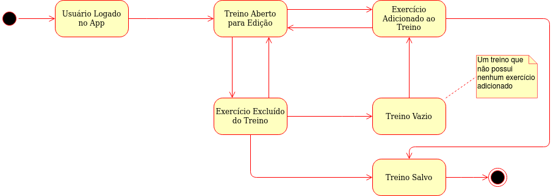

# Diagrama de Estados

## 1. Introdução

O diagrama de estados é um diagrama dinâmico que procura apresentar os vários estados pelos quais um objeto pode passar dentro da aplicação e as transações responsáveis pelas suas mudanças de estado, que podem ser eventos internos ou externos ao sistema.

## 2. Diagrama de Estados

### 2.1. Edição de treino

## Referências

[1] State Machine Diagrams. Disponível em: <https://www.uml-diagrams.org/state-machine-diagrams.html>. Acesso em: 24 set. 2020.

[2] Videoaulas e materiais complementares presentes no moodle da disciplina Arquitetura e Desenho de Software. Disponível em: <https://aprender3.unb.br/course/view.php?id=158>. Acesso em: 24 set. 2020.

#### Histórico de revisões
|    Data    | Versão |       Descrição       |    Autor(es)     |
| :--------: | :----: | :-------------------: | :--------------: |
| 24/09/2020 |  1.0   | Iniciando o documento | Weiller Fernandes|
| 25/09/2020 | 1.1 | Adicionando Diagrama de Estados 2.1| Weiller Fernandes |