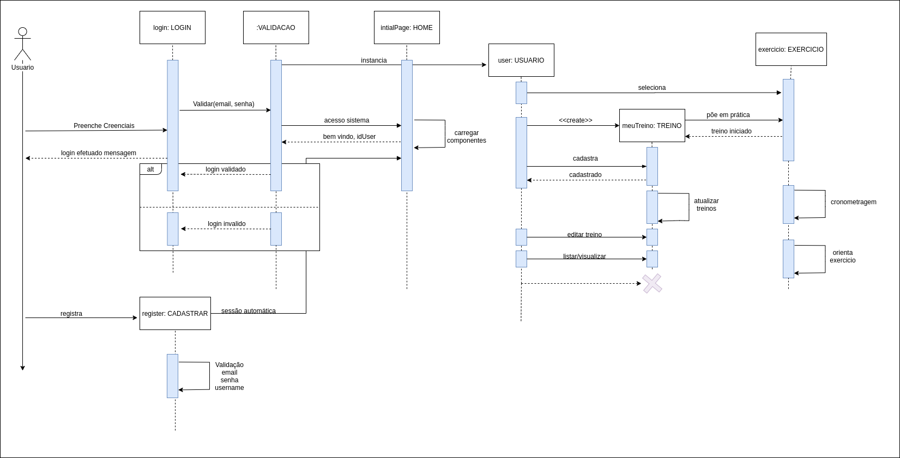

## Diagrama Sequência

O diagrama de sequência é o tipo mais comum de diagrama de interação, que se concentra no intercâmbio de mensagens entre várias linhas de vida. O diagrama de sequência descreve uma interação focando na sequência de mensagens que são trocadas, junto com suas especificações de ocorrência correspondentes. 
Os seguintes nós e arestas são normalmente desenhados em um diagrama de sequência UML : linha de vida, especificação de execução, mensagem, fragmento combinado, uso de interação, invariante de estado, continuação, ocorrência de destruição.

### Diagrama de Sequência - WoCo

**Versão: 0.1**  
*Autor: Bruno Duarte.*
>Primeira versão do Diagrama de Sequência que visa demonstrar as relações entre usuário e aplicação, mostrando como são registrados seus treinos e exercicios junto a execução do processo

#### Histórico de revisões
|    Data    | Versão |       Descrição       |    Autor(es)     |
| :--------: | :----: | :-------------------: | :--------------: |
| 27/09/2020 |  0.0   | Iniciando o documento | Bruno Duarte|
| 27/09/2020 |  0.1   | Adicionando o Diagrama | Bruno Duarte|
