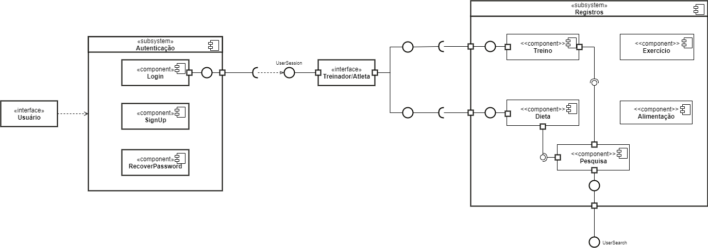
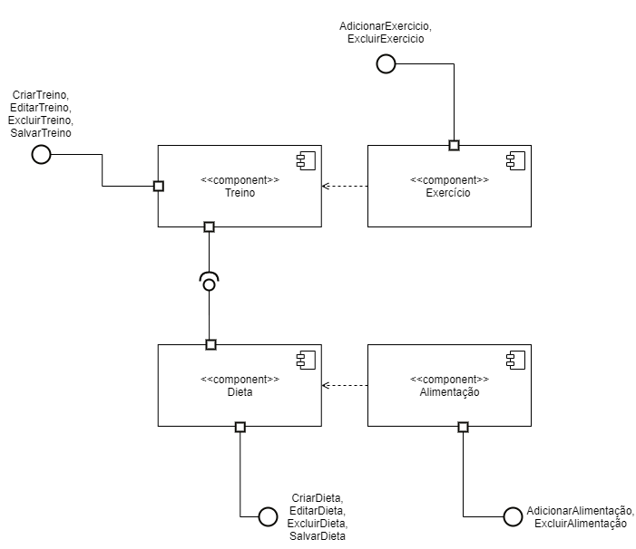
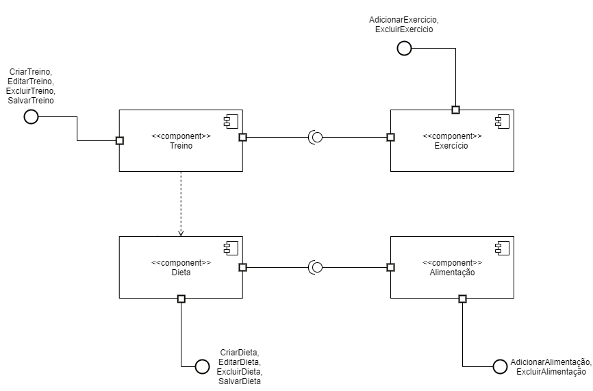

# Diagrama de Componentes

#### Histórico de revisões
|    Data    | Versão |       Descrição       |    Autor(es)     |
| :--------: | :----: | :-------------------: | :--------------: |
| 25/09/2020 |  1.0   | Iniciando o documento | Davi Alves |
| 28/09/2020 |  2.0   | Atualizando o documento | Davi Alves |

## 1. Introdução

O Diagrama de Componentes apresenta uma visão estática de como o sistema será implementado e quais os componentes utilizados. Através deste diagrama, são identificados os arquivos que irão compor o software em termos de módulos, bibliotecas, formulários, etc., além de identificar os relacionamentos destes. Além de modelar os componentes, este diagrama destaca a função de cada componente, facilitando a sua reutilização em outros sistemas.

Geralmente é ultilizado para:

- Modelar os dados do código fonte, do código executável do software.

- Destacar a função de cada módulo para facilitar a sua reutilização.

- Auxiliar no processo de engenharia reversa, por meio da organização dos módulos do sistema e seus relacionamentos.

Devido a sua complexidade nosso diagrama de componentes estará em constante mudanças, sendo consideradas as versões lançadas.

## 2. Diagrama de Componentes

> Num primeiro momento o diagrama de componentes foi elaborado para mostrar de forma geral e ampla, com apenas o foco no login para o usuario que sera setado como "Treinador" ou "Atleta".

*Versão 1.0 - Diagrama de Componentes Completo* 

> O segundo diagrama foca no sub sistema que possui as funcionalidades principais do WoCo, foi separada da primeira para melhor organização e para não cruzar os relacionamentos. 

*Versão 1.0 - Diagrama de Componentes Registros*

*Versão 2.0 - Diagrama de Componentes Registros*

## Referências

[1] UML Component Diagrams. Disponível em: <https://www.uml-diagrams.org/component-diagrams.html>. Acesso em: 25 set. 2020.

[2] UML Port. Disponível em: <https://www.uml-diagrams.org/port.html?context=components>. Acesso em: 25 set. 2020.

[3] UML Connector. Disponível em: <https://www.uml-diagrams.org/composite-structure-diagrams/connector.html?context=components>. Acesso em: 25 set. 2020.

[4] UML Component Diagrams Reference. Disponível em: <https://www.uml-diagrams.org/component-diagrams-reference.html>. Acesso em: 25 set. 2020.

[5] Videoaulas e materiais complementares presentes no moodle da disciplina Arquitetura e Desenho de Software. Disponível em: <https://aprender3.unb.br/course/view.php?id=158>. Acesso em: 25 set. 2020.
