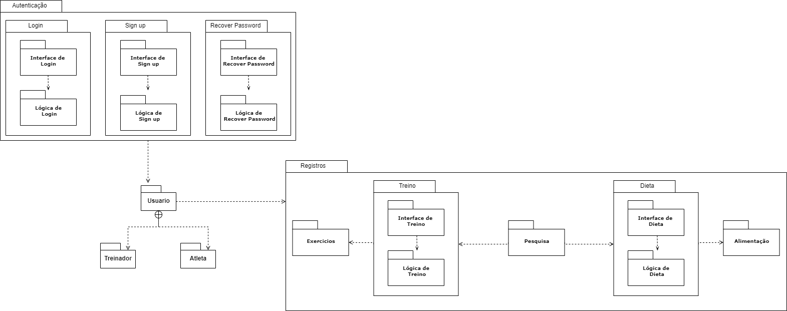
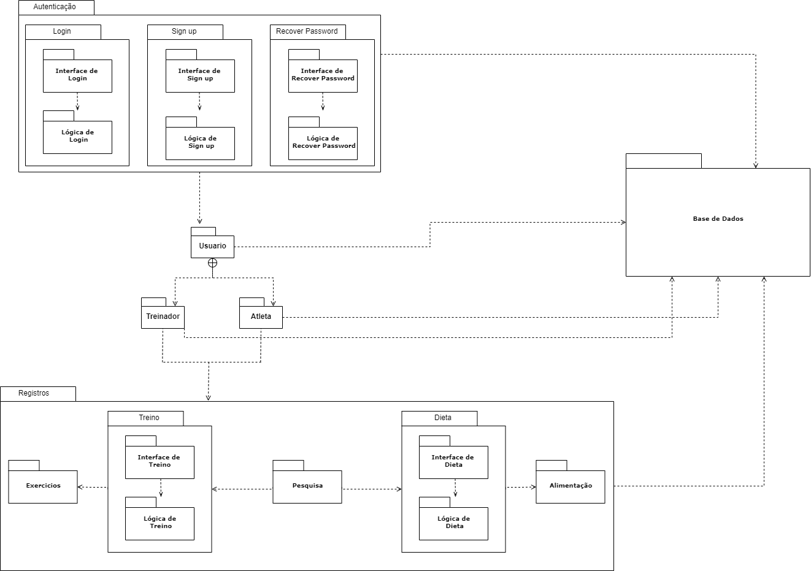

# Diagrama de Pacotes

## 1. Introdução

Os diagramas de pacotes são frequentemente utilizados para
representar subsistemas, módulos ou parte da arquitetura de um
sistema. Seu elemento principal é o pacote.

– Um pacote pode representar muitas coisas: uma camada, um módulo,
um subsistema, um espaço de nomes, etc. A ideia principal é a de que
um pacote é um elemento capaz de agrupar outros elementos e ainda
denominar tais grupos.

– Um pacote UML pode agrupar qualquer coisa: classes, outros pacotes,
casos de uso, etc.

– O elemento pacote pode ser utilizado em diversos outros diagramas
como o digrama de classes ou o diagrama de casos de uso.

A linha de dependência UML pode ser utilizada para mostrar as
dependências entre pacotes ou entre elementos dos pacotes.

## 2. Diagrama de Pacotes

Versão-01

Versão-02

## Referências

[1] UML Package Diagrams Overview. Disponível em: <https://www.uml-diagrams.org/package-diagrams-overview.html>. Acesso em: 22 set. 2020.

[2] Videoaulas e materiais complementares presentes no moodle da disciplina Arquitetura e Desenho de Software. Disponível em: <https://aprender3.unb.br/course/view.php?id=158>. Acesso em: 22 set. 2020.

#### Histórico de revisões
|    Data    | Versão |       Descrição       |    Autor(es)     |
| :--------: | :----: | :-------------------: | :--------------: |
| 22/09/2020 |  1.0   | Iniciando o documento | Davi Alves |
| 26/09/2020 |  2.0   | Adicionando segunda versão do diagrama | Davi Alves |
