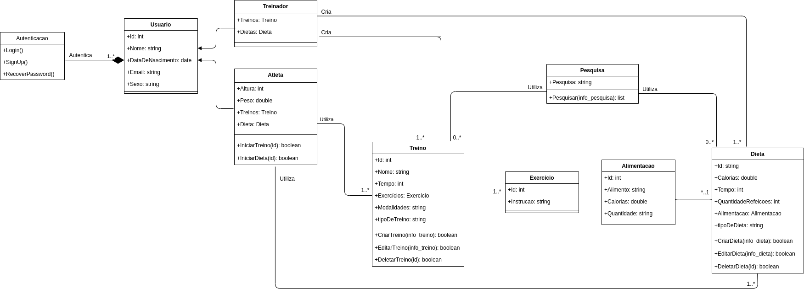
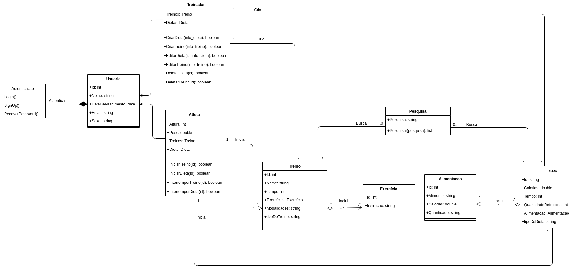
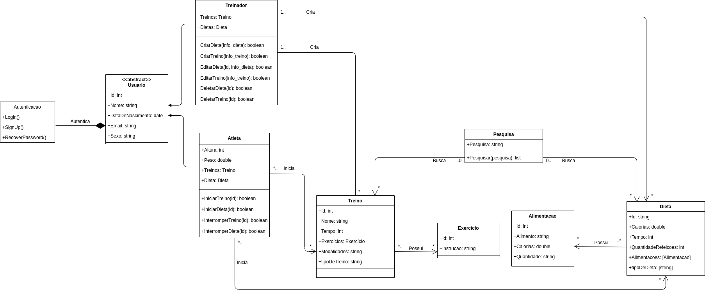

## UML - Diagrama de Classes

### Versão 0.1

### Versão 1.0 com relações

### Versão 2.0 com Depedência e Associação

### Histórico de revisões
|Data|Versão|Alteração|Autor|
|----|------|---------|-----|
| 22/09/2020 | 0.1 | Criação do diagrama de classes UML | Ernando Braga |
| 27/09/2020 | 1.0 | Adição de relacionamento de classes UML | Ernando Braga e Eugênio Sales |
| 28/09/2020 | 2.0 | Adição de Classes Concretas, Abstratas, Sobrescrita e Sobrecarga, e Dependência e Associação | Ernando Braga e Eugênio Sales |

### Referências

[1] UML Class and Object Diagrams Overview. Disponível em: <https://www.uml-diagrams.org/class-diagrams-overview.html>. Acesso em: 22 set. 2020.

[2] Hospital Management: UML Class Diagram Example. Disponível em: <https://www.uml-diagrams.org/examples/hospital-domain-diagram.html>. Acesso em: 21 set. 2020.