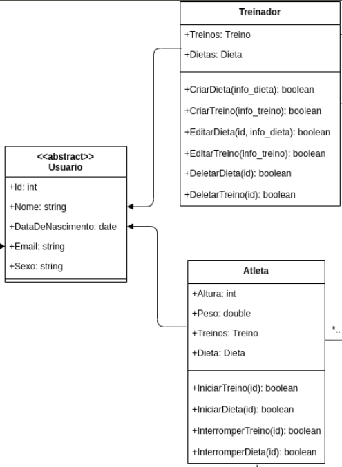
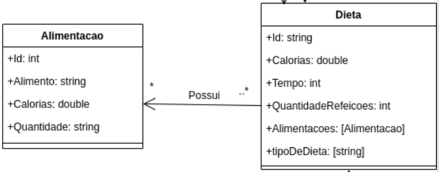
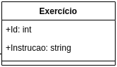
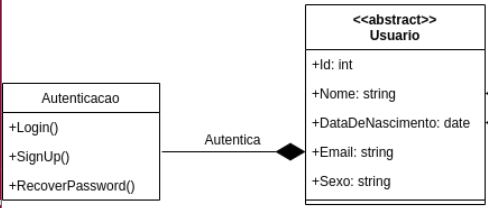
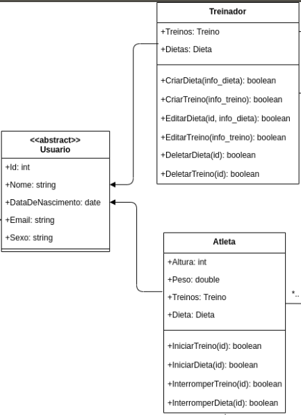

# Estudo GRASPs

#### Histórico de revisões
|   Data   |  Versão  |        Descrição       |          Autor(es)          |
|:--------:|:--------:|:----------------------:|:---------------------------:|
|06/10/2020| 0.1 | Iniciando o documento       |  Weiller Fernandes  |
|06/10/2020| 0.2 | Adicionando os GRASPs Criador e Especialista | Weiller Fernandes |
|13/10/2020| 0.3 | Adicionando os GRASPs Alta Coesão e Baixo Acoplamento | Weiller Fernandes|
|13/10/2020| 0.4 | Adicionando os GRASPs Controladora e Polimorfismo | Weiller Fernandes|

## 1. Introdução

Padrões de projetos são princípios e soluções usados durante a criação de um software, codificado em um formato estruturado e bem estabelecido, descrevendo o problema no qual se deseja mitigar, bem como uma solução para esse problema. No caso do software, essa solução pode vir através de modelagem e código.
O Grasp é um padrão de projeto, onde se analisa o desenho do software para que seja possível identificar as entidades envolvidas, bem como suas responsabilidades e dessa forma, seja feita uma solução adequada para a resolução de um determinado problema.

Esse documento busca formalizar o estudo inicial dos GRASPs, definindo e correlacionando cada um deles com o projeto WoCo, através dos artefatos de modelagem criados no módulo anterior.

## Padrões GRASP

### Criador

Padrão de projeto que representa classes responsáveis por criar instâncias. No caso do aplicativo WoCo, uma classe que pode ser um creator é a classe de Usuario, que é responsável por criar o usuário, seja ele treinador ou atleta, dentro da plataforma. Outra opção de criador é a classe Treinador, pois essa classe é responsável por criar treinos e dietas que ficarão disponíveis para o atleta.

[Diagrama de Classes Completo](../../Modelagem/2.1%20M%C3%B3dulo%20Projeto%20Orientado%20a%20Abordagens%20Tradicionais/Diagramas%20Est%C3%A1ticos/umlClasses.md#vers%C3%A3o-20-com-deped%C3%AAncia-e-associa%C3%A7%C3%A3o)

### Especialista

Padrão de projeto que se preocupa em atribuir responsabilidades para a entidade mais especialista em um dado aspecto. Um exemplo de especialista no WoCo é a Classe Dieta, que é especialista em calcular a quantidade total de calorias de uma dieta, por exemplo. Nesse caso a classe Alimentacao deve fornecer o valor das calorias de cada alimento para a classe Dieta, e essa calcula o valor total com base nos dados fornecidos pela classe Alimentacao.

[Diagrama de Classes Completo](../../Modelagem/2.1%20M%C3%B3dulo%20Projeto%20Orientado%20a%20Abordagens%20Tradicionais/Diagramas%20Est%C3%A1ticos/umlClasses.md#vers%C3%A3o-20-com-deped%C3%AAncia-e-associa%C3%A7%C3%A3o)

### Alta Coesão

O conceito da coesão está intimamente ligado ao Princípio da Responsabilidade Única (SRP) do SOLID. O SRP aplica-se a qualquer artefato contido no modelo do software, como classes e objetos. Um componente com Alta Coesão é um componente que possui apenas uma única responsabilidade, que possui em seu conteúdo ou funções, apenas aquilo que realmente deve fazer. No WoCo, um bom exemplo de alta coesão é a classe Exercicio, que possui apenas um identificador e a instrução de como o atleta deve executar aquele exercício para que ela seja feito de forma correta, ou seja, essa classe apresenta apenas as informações necessárias à ela.

[Diagrama de Classes Completo](../../Modelagem/2.1%20M%C3%B3dulo%20Projeto%20Orientado%20a%20Abordagens%20Tradicionais/Diagramas%20Est%C3%A1ticos/umlClasses.md#vers%C3%A3o-20-com-deped%C3%AAncia-e-associa%C3%A7%C3%A3o)

### Baixo Acoplamento

O acoplamento pode ser entendido como a união ou ligação entre dois ou mais corpos, formando um único conjunto. Em um software, o acoplamento acontece no relacionamento entre classes, tabelas, domínios, etc. O ideal é que esse acoplamento seja baixo, para que sua manutenção possa ser realizada de forma mais simples, caso contrário, se uma classe, função ou método precisar ser modificado, inúmeros outros também podem precisar passar por alterações em sua estrutura. No aplicativo WoCo, podemos ver um exemplo de baixo acoplamento entre as classes Alimentacao e Dieta. A classe Alimentacao fornece os valores de calorias de cada alimento para a classe Dieta, e essa faz o cálculo do total de calorias de toda a Dieta. Porém, se a forma como o total de calorias é calculado, precisar ser modificado no software ao longo do tempo, a classe Alimentacao não será afetada, pois ela não lida com o cálculo em si, apenas com o valor de calorias de cada alimento, isso demonstra um baixo acoplamento entre essas classes.

[Diagrama de Classes Completo](../../Modelagem/2.1%20M%C3%B3dulo%20Projeto%20Orientado%20a%20Abordagens%20Tradicionais/Diagramas%20Est%C3%A1ticos/umlClasses.md#vers%C3%A3o-20-com-deped%C3%AAncia-e-associa%C3%A7%C3%A3o)

### Controladora

O padrão controlador atribui a responsabilidade de manipular eventos do sistema para uma classe que não seja de interface do usuário (UI) que representa o cenário global ou cenário de caso de uso. Um objeto controlador é um objeto de interface não-usuário, responsável por receber ou manipular um evento do sistema. Dentro do WoCo, um exemplo de controladora pode ser dado pela classe Autenticacao, pois essa é responsável por controlar e tratar os eventos relacionados à autenticação do usuário, como o login, signUp e recuperação de senha.

[Diagrama de Classes Completo](../../Modelagem/2.1%20M%C3%B3dulo%20Projeto%20Orientado%20a%20Abordagens%20Tradicionais/Diagramas%20Est%C3%A1ticos/umlClasses.md#vers%C3%A3o-20-com-deped%C3%AAncia-e-associa%C3%A7%C3%A3o)

### Polimorfismo

Polimorfismo é um princípio a partir do qual as classes derivadas de uma única classe base são capazes de invocar os métodos que, embora apresentem a mesma assinatura, comportam-se de maneira diferente para cada uma das classes derivadas. Com o polimorfismo, os mesmos atributos e métodos podem ser utilizados em objetos distintos, porém, com implementações lógicas diferentes. No aplicativo WoCo, as classes Treinador e Atleta herdam da classe abstrata Usuario, as informações necessárias para cada instância de seus objetos. Sendo assim, essas classes exemplificam a aplicação do polimorfismo no app.

[Diagrama de Classes Completo](../../Modelagem/2.1%20M%C3%B3dulo%20Projeto%20Orientado%20a%20Abordagens%20Tradicionais/Diagramas%20Est%C3%A1ticos/umlClasses.md#vers%C3%A3o-20-com-deped%C3%AAncia-e-associa%C3%A7%C3%A3o)

## Referências

[1] Videoaulas e materiais complementares presentes no moodle da disciplina Arquitetura e Desenho de Software. Disponível em: https://aprender3.unb.br/course/view.php?id=158
[2] Acoplamento e Coesão. Disponível em: https://www.ateomomento.com.br/acoplamento-e-coesao/
[3] GRASP (padrão orientado a objetos), Padrão Controladora. Disponível em: https://pt.wikipedia.org/wiki/GRASP_(padr%C3%A3o_orientado_a_objetos)#Controller_(controlador)
[4] Conceitos e Exemplos – Polimorfismo: Programação Orientada a Objetos. Disponível em: https://www.devmedia.com.br/conceitos-e-exemplos-polimorfismo-programacao-orientada-a-objetos/18701
