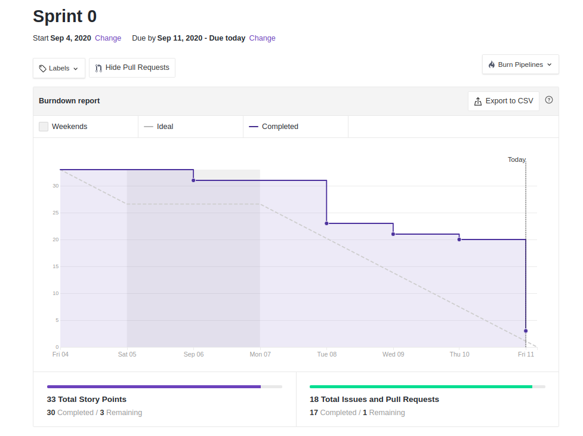

# Sprint 0: Review

## Duração da sprint
| Início | Término |
|:------:|:-------:|
| 01/04/2020 | 11/04/2020 |

## Resumo da Sprint
Esta sprint teve como marco a definição da temática do projeto e criação de documentação de base.  

___
## Fechamento da Sprint

|Issue|Responsável|Épico|Status|Pontos|
|:---:|:---------:|:---:|:----:|:----:|
| Planos de risco | Ernando | Docs | Concluída | 2 |
| Custo e tempo | Bruno e Ernando | Docs | Concluída | 3 |
| Prototipo de baixa fidelidade | Bruno | UI/UX | Concluída | 2 |
| Backlog do produto | Bruno | Design Sprint | Concluída | 3 |
| Roadmap do Produto | Ernando | Design Sprint | Descontinuada | 3 |
| Levantamento de requisitos | Todos | Elicitação | Concluída | 3 |
| Levantamento de ferramentas e tecnologias |Ernando | Docs | Concluída | 1 |
| Entrevista | Weiller | Elicitação | Concluída | 1 |
| Github pages | Davi | Docs | Concluída | 1 |
| Estimativa - Custo e tempo | Bruno e Ernando | Docs | Concluída | 1 |
| Wiki | Eugênio | Docs | Concluída | 1 | 
| Desenho detalhado da metodologia do projeto, utilizando a notação BMPN | Eugênio | Docs | Concluída | 1 |
| Pequeno áudio procurando explicar em linhas gerais a metodologia utilizada. | Eugênio | Docs | Concluída | 1 |
| Definição de tema | todos | - | Concluída | 1 |
| Rich Picture | Davi e Bruno | Pré-rastreabilidade | Concluída | 1 |
| 5w2h | Weiller | Pré-rastreabilidade | Concluída | 1 |
| Mapa mental| Davi | Pré-rastreabilidade | Concluída | 1 |
| Questionário | Davi | Elicitação | Concluída | 2 |
| Introspecção | Weiller | Elicitação | Concluída | 2 |
| Diagrame de causa e efeito | Ernando | Elicitação | Concluída | 2 |
| Documento de visão | Eugenio e Bruno | Docs | Concluída | 2 |
| Políticas de desenvolvimento | Ernando | Docs | Concluída | 1 |

___

## Pontos
| Planejados | Concluídos |      
|:----------:|:----------:|
| 36 | 33 |

## Sprint Burndown

<!--  -->

## Sprint Velocity
    * O velocity será apresentado a partir da próxima sprint

## Sprint Review

### Positivo
    * O grupo conseguiu cumprir com qualidade essa etapa Base do projeto
    * Foram realizadas iniciativas extras além das pedidas pela disciplina
    * A metodologia Scrum já está sendo adotada desde o início da disciplina

### Negativo
    * Como o Burndow demonstra, temos que ser mais constantes com entrega. Mas um ponto de ressalva, é que alguns integrantes ainda não muito adaptados ao workflow na metodologia, marcaram as tarefas como concluidas com certo atraso embora tenham feito com mais antecedência

### A Melhorar
    * Um dos pontos a melhorar do grupo continua sendo a constância durante a sprint nas entregas

## Version control

|Date|Version|Update|Author|
|:--:|:----:|:-------:|:---:|
|11/09/2020|0.1|Sprint Review|Eugênio Sales|