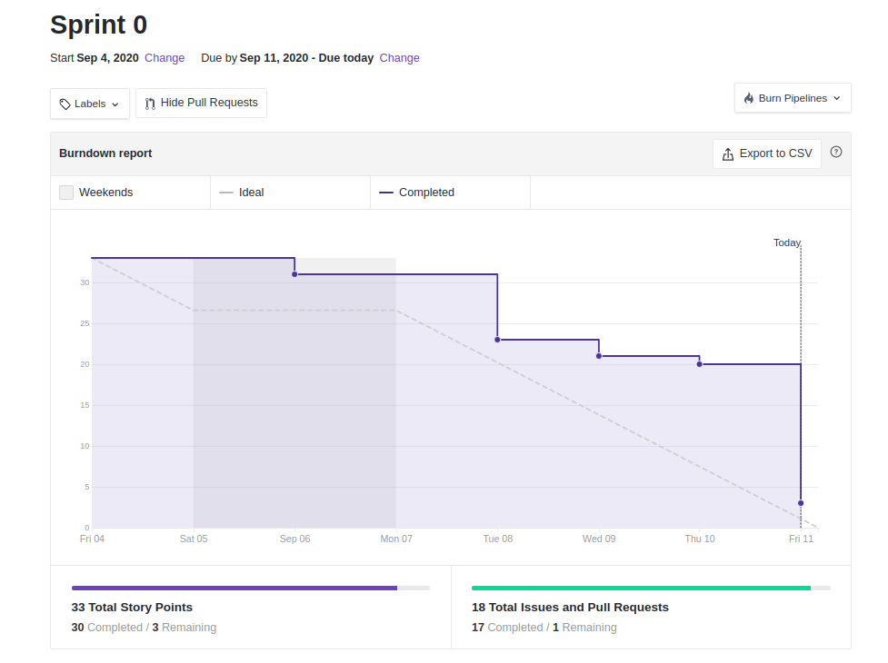
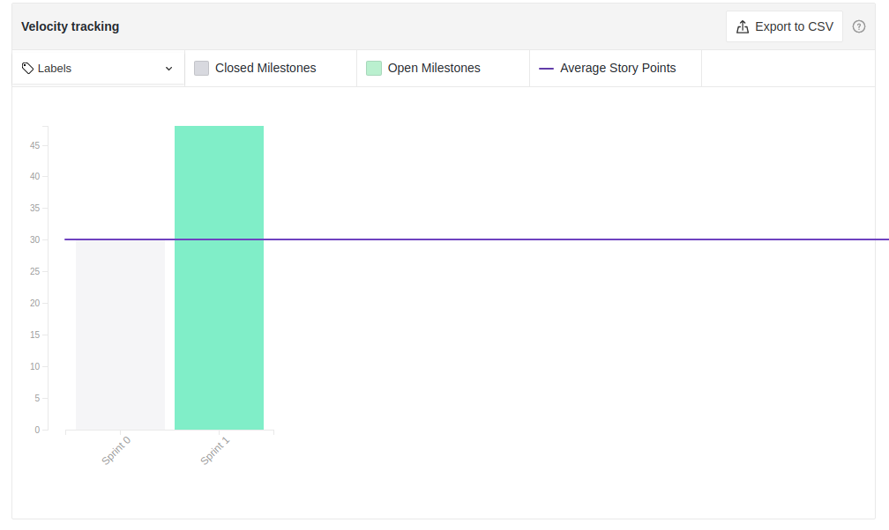

# Sprint 1: Review

## Duração da sprint
| Início | Término |
|:------:|:-------:|
| 19/09/2020 | 28/09/2020 |

## Resumo da Sprint
Esta sprint teve como marco a produção dos digramas estáticos e dinâmico respectivos ao módulo de modelagem, bem como evolução da rastreabilidade  

___
## Fechamento da Sprint

|Issue|Responsável|Épico|Status|Pontos|
|:---:|:---------:|:---:|:----:|:----:|
| Diagrama de pacotes | Davi | Modelagem | Concluída | 3 |
| Diagrama de classes | Ernando | Modelagem | Concluída | 5 |
| Diagrama de componentes | Davi | Modelagem | Concluída | 5 |
| Diagrama de Dependência & Associação | Ernando | Modelagem | Concluída | 3 |
| Diagrama Classe Concreta & Abstrata & Sobrescrita & Sobrecarga | Ernando | Modelagem | Concluída | 5 |
| Diagrama Agregação & Composição | Eugênio | Modelagem | Concluída | 3 |
| Diagrama Herança & Realização |Eugênio | Modelagem | Concluída | 3 |
| Diagrama de Sequência | Bruno | Modelagem | Concluída | 3 |
| Diagrama de Comunicação | Bruno | Modelagem | Concluída | 3 |
| Diagrama de Atividades | Weiler | Modelagem | Concluída | 5 |
| Diagrama de Estados | Weiler | Modelagem | Concluída | 5 |
| Tabela de requisitos com rastreabilidade | Todos | Modelagem | Concluída | 5 |
| Roadmap do Produto | Ernando | Iniciativas extras | Débito | 3 |

___

## Pontos
| Planejados | Concluídos |      
|:----------:|:----------:|
| 51 | 48 |

## Sprint Burndown

<!--  -->

## Sprint Velocity

## Sprint Review

### Positivo
    * A organização ficou melhor, conseguimos entregar tudo mesmo que algumas coisas acabaram atrasando um pouco
    * Qualidade das entregas aumentando
    * Uso dos PRs e revisões dos documentos funcionou bem na Sprint
    * Toda documentação foi feita e revisada por ao menos um membro

### Negativo
    * Pouco tempo hábil para a quantidade e complexidade do trabalho a ser feito nesse módulo
    * Divisão de tarefas ficou desproporcional
    * Issues em Review demorando a serem fechadas

### A Melhorar
    * Constância no Burndown da Sprint
    * Mais iniciativas extras nos módulos pra incrementar a avaliacao do projeto
    * Melhorar preparação da sprint planning para melhor pontuação e divisão das tarefas
    * Tentar aumentar a comunicação dentro do grupo e tentar fazer tarefas com mais antecedência para dar tempo de revisar e corrigir, se necessário
    

## Version control

|Date|Version|Update|Author|
|:--:|:----:|:-------:|:---:|
|28/09/2020|0.1|Sprint Review|Eugênio Sales|
