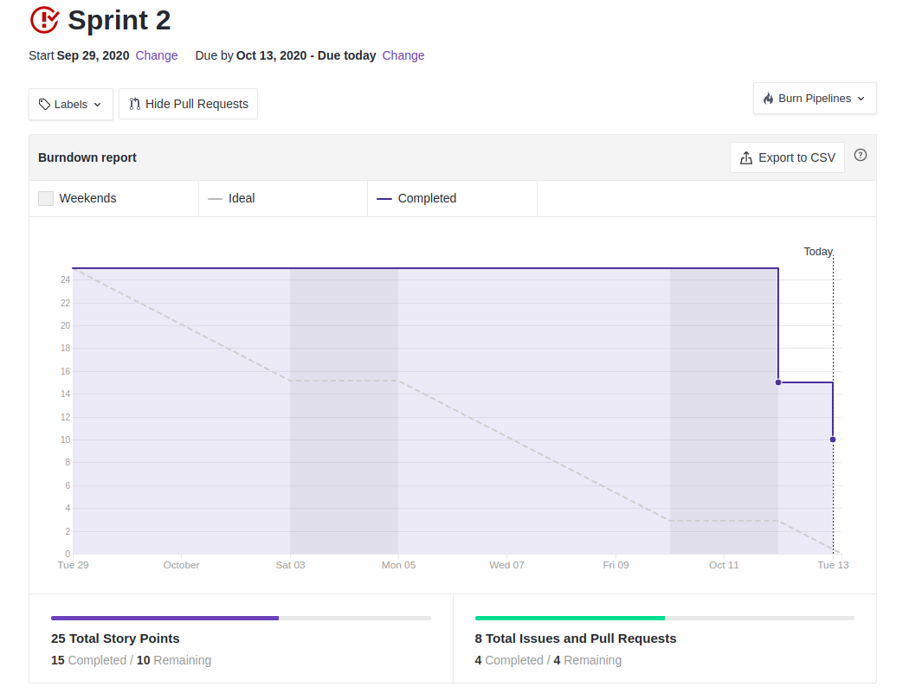
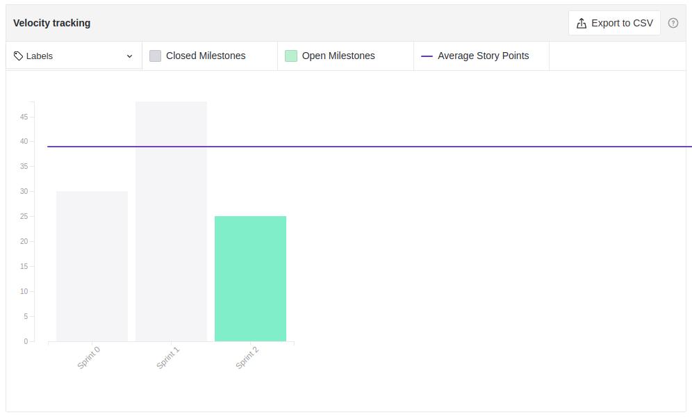

# Sprint 2: Review

## Duração da sprint
| Início | Término |
|:------:|:-------:|
| 29/09/2020 | 13/10/2020 |

## Resumo da Sprint
Foram elaborados artefatores referentes aos padrões de projeto GRASP e GOF para documentação de possíveis alternativas de aplicação no projeto delineado.

___
## Fechamento da Sprint

|Issue|Responsável|Épico|Status|Pontos|
|:---:|:---------:|:---:|:----:|:----:|
| Estudo GOF Criacional | Eugênio e Ernando | Padrões de projeto | Concluída | 3 |
| Estudo GOF Estrutural | Ernando e Bruno | Padrões de projeto | Concluída | 5 |
| Estudo GOF Comportamental | Bruno e Eugênio | Padrões de projeto | Concluída | 5 |
| Estudo GRASP | Weiller e Davi | Padrões de projeto | Débito | 5 |
| Ambientação do Frontend | Eugênio | Frontend | Concluída | 2 |
| Ambientação do Backend | Davi | Backend | Débito | 2 |
| Roadmap do Produto | Ernando | Iniciativas extras | Débito | 3 |
___

## Pontos
| Planejados | Concluídos |      
|:----------:|:----------:|
| 25 | 15 |

## Sprint Burndown

<!--  -->

## Sprint Velocity

## Sprint Review

### Positivo
    * Os pareamentos foram produtivos

### Negativo
    * Issues em Review demorando a serem fechadas
    * Burndown ruim devido a demora de revisão dos PR's

### A Melhorar
    * Sìstema de revisão de PR's entre os membros

## Version control

|Date|Version|Update|Author|
|:--:|:----:|:-------:|:---:|
|13/10/2020|0.1|Sprint Review|Eugênio Sales|
