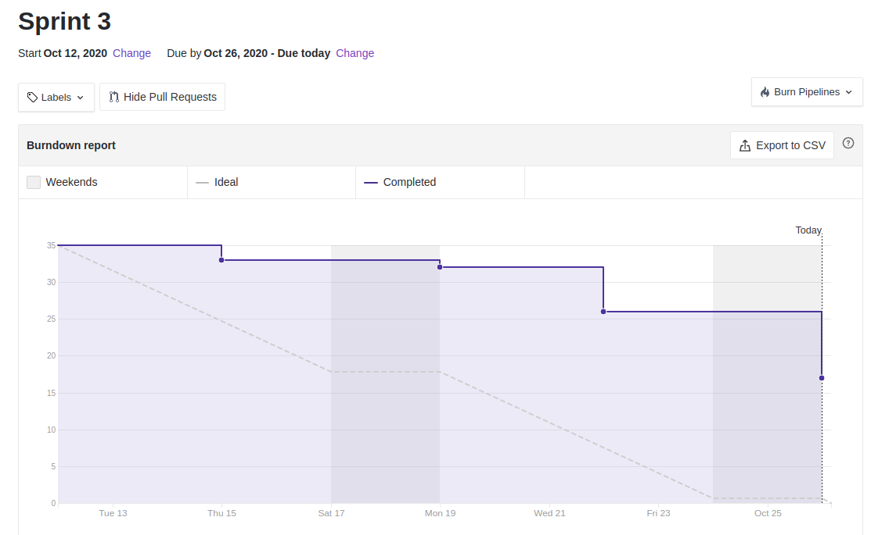
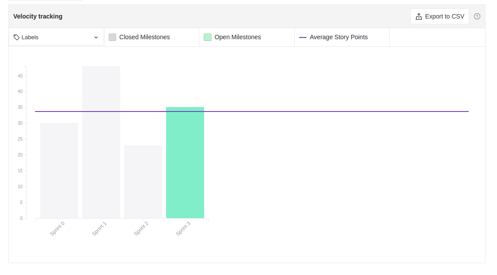
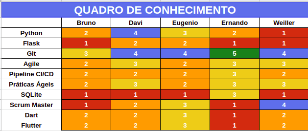

# Sprint 3: Review

## Duração da sprint
| Início | Término |
|:------:|:-------:|
| 13/09/2020 | 26/10/2020 |

## Objetivo da Sprint
Foram produzidas estórias do épico de treino e acesso no backend e frontend. Além disso, foi feita uma evolução dos docs de aplicação dos GoFs e Grasps das features abordadas para sprint.
___
## Fechamento da Sprint

|Issue|Responsável|Épico|Status|Pontos|
|:---:|:---------:|:---:|:----:|:----:|
| US01 - Cadastro - Backend | Ernando e Bruno | Acesso | Débito | 8 |
| US01 - Cadastro - Frontend | Eugênio | Acesso | Concluída | 5 |
| US02 - Login - Backend | Ernando e Bruno | Acesso | Débito | 3 |
| US02 - Login - Frontend | Eugênio | Acesso | Concluída | 3 |
| US03 - Listar Treinos - Backend | Ernando e Bruno | Treinos | Débito | 3 |
| US03 - Listar Treinos - Frontend | Weiller | Treinos | Concluída | 3 |
| US04 - Criar Treinos - Backend | Davi e Ernando | Treinos | Débito | 3 |
| US04 - Criar Treinos - Frontend | Weiller | Treinos | Concluída | 3 |
| Refatorar Backlog | Ernando | Iniciativas extras | Concluída | 2 |
| Atualizar GhPages | Todos | Iniciativas extras | Concluída | 1 |
| Criação de Quadro do conhecimento | Davi | Iniciativas extras | Concluída | 1 |
___

## Extra
|Issue|Responsável|Épico|Status|Pontos|
|:---:|:---------:|:---:|:----:|:----:|
| Criação de StotyBoard | Bruno | Iniciativas extras | Concluída | 1 |

## Pontos
| Planejados | Concluídos |      
|:----------:|:----------:|
| 46 | 19 |

## Sprint Burndown

<!--  -->

## Sprint Velocity

## Quadro do conhecimento

## Sprint Review

### Positivo
    * Os pareamentos foram produtivos
    * Começamos a implementação do código
    * Conseguimos aplicar um bom número de padrões de projeto no Woco
    * Burndown nao está mais caindo só no último dia

### Negativo
    * Dificuldade de marcar pareamento devido conflito de horários

### A Melhorar
    * Sìstema de revisão de PR's entre os membros
    * Atualizar artefatos antigos para a entrega final

## Version control

|Date|Version|Update|Author|
|:--:|:----:|:-------:|:---:|
|26/10/2020|0.1|Sprint Review|Eugênio Sales|
