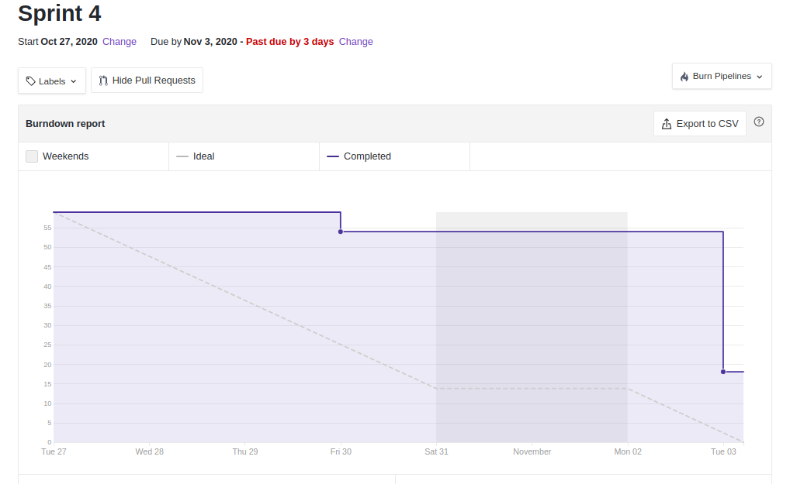
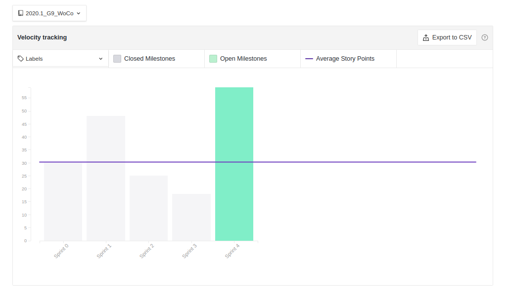

# Sprint 4: Review

## Duração da sprint
| Início | Término |
|:------:|:-------:|
| 27/10/2020 | 03/11/2020 |

## Objetivo da Sprint
Documentação de estilos e arquitetura do WoCo, evolução de artefatos de modelagem para o DAS e conclusão de débitos de implementação de código.
___
## Fechamento da Sprint

|Issue|Responsável|Épico|Status|Pontos|
|:---:|:---------:|:---:|:----:|:----:|
| Introdução | Bruno | DAS | Concluída | 1 |
| Representação arquitetural | Weiler | DAS | Concluída | 5 |
| Objetivo arquiteturais e restrições | Eugênio | DAS | Concluída | 5 |
| Visão de caso de uso | Weiler | DAS | Concluída | 3 |
| Visão Lógica | Eugênio | DAS | Concluída | 5 |
| Visão de processo | Ernando | DAS | Concluída | 5 |
| Visão de deploy | Bruno | DAS | Concluída | 5 |
| Visão de implementação | Davi | DAS | Concluída | 3 |
| Tamanho e performance | Eugênio | DAS | Débito | 5 |
| Qualidade | Ernando | DAS | Concluída | 8 |
| Evolução diagrama de classes (Implementação) | Davi | Modelagem | Concluída | 3 |
| Evolução diagrama de componentes | Weiler | Modelagem | Débito | 3 |
| Evolução diagrama de comunicação | Ernando | Modelagem | Concluída | 3 |
| Evolução diagrama de sequência (Processo) | Ernando | Modelagem | Concluída | 3 |
| Documento de reutização de software | Todos | Modelagem | Débito | 8 |
| US01 - Cadastro - Backend | Ernando e Bruno | Desenvimento - Acesso | Débito | 8 |
| US02 - Login - Backend | Ernando e Bruno | Desenvimento - Acesso | Débito | 3 |
| US03 - Listar Treinos - Backend | Ernando e Bruno | Desenvimento - Acesso | Débito | 3 |
| US04 - Criar Treinos - Backend | Davi e Ernando | Desenvimento - Acesso | Débito | 3 |

___

## Pontos
| Planejados | Concluídos |      
|:----------:|:----------:|
| 67| 49 |

## Sprint Burndown

<!--  -->

## Sprint Velocity

## Quadro do conhecimento

## Sprint Review

### Positivo
    * Refatorações de artefatos antigos foram feitas para inclusão no DAS
    * Documento de arquitetura está bem encaminhado

### Negativo
    * Débitos abertos

### A Melhorar
    * Conclusão dos débitos

## Version control

|Date|Version|Update|Author|
|:--:|:----:|:-------:|:---:|
|03/11/2020|0.1|Sprint Review|Eugênio Sales|
