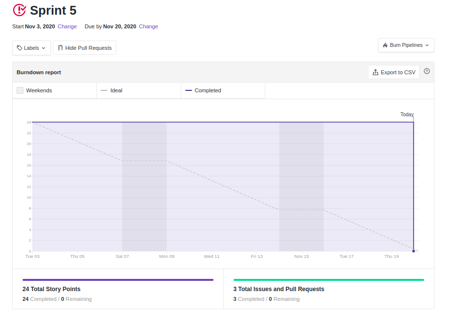
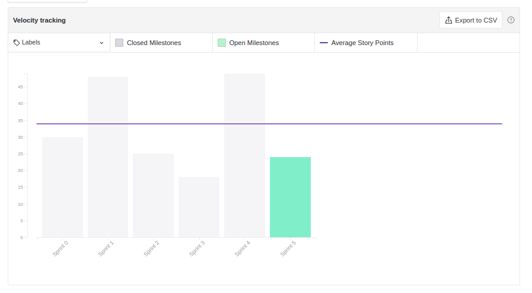
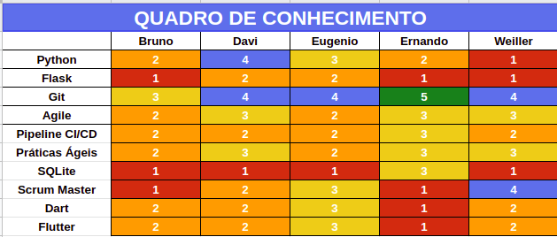

# Sprint 5: Review

## Duração da sprint
| Início | Término |
|:------:|:-------:|
| 03/11/2020 | 20/11/2020 |

## Objetivo da Sprint
Conclusão de débitos de implementação de código e implementação de novas features.
___
## Fechamento da Sprint

|Issue|Responsável|Épico|Status|Pontos|
|:---:|:---------:|:---:|:----:|:----:|
| US01 - Cadastro - Backend | Ernando e Bruno | Desenvimento - Acesso | Concluída | 8 |
| US02 - Login - Backend | Ernando e Bruno | Desenvimento - Acesso | Concluída | 3 |
| US03 - Listar Treinos - Backend | Ernando e Bruno | Desenvimento - Acesso | Concluída | 3 |
| US04 - Criar Treinos - Backend | Davi e Ernando | Desenvimento - Acesso | Concluída | 3 |
| Tamanho e performance | Eugênio | DAS | Concluída | 5 |
| Evolução diagrama de componentes | Weiler | Modelagem | Concluída | 3 |
| Documento de reutização de software | Todos | Modelagem | Concluída | 8 |
| US02 à US05 - Exercícios - Frontend | Eugênio | Desenvolvimento - Treinador | Concluída | 8 |
| US011 à US14 - Alimentação - Frontend | Weiller | Desenvolvimento - Treinador | Concluída | 8 |
| US011 à US14 - Alimentação - Backend | Ernando, Davi e Bruno | Desenvolvimento - Treinador | Concluída | 8 |
___

## Pontos
| Planejados | Concluídos |      
|:----------:|:----------:|
| 24| 24 |

## Sprint Burndown

<!--  -->

## Sprint Velocity

## Quadro do conhecimento

## Sprint Review

### Positivo
    * Evolução do DAS e doc de reutilização
    * Entrega dos pontos de débito

### Negativo
    * Burndown não seguiu o padrão das últimas sprints

### A Melhorar
    * Organização da gerência do backlog

## Version control

|Date|Version|Update|Author|
|:--:|:----:|:-------:|:---:|
|20/11/2020|0.1|Sprint Review|Eugênio Sales|
